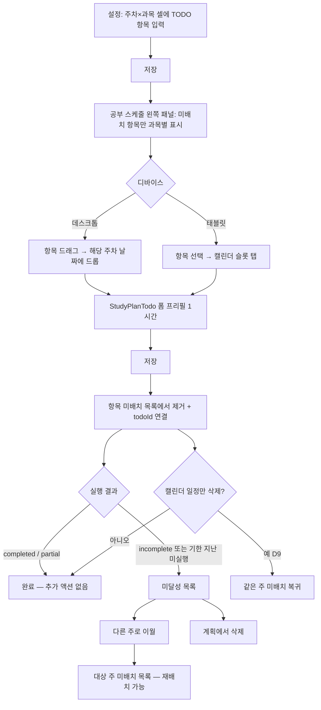

# 시험기간 주차별 공부계획 — TODO 항목·캘린더 배치 구현 계획

> **작성일:** 2026-06-27  
> **범위:** 시험기간 주차별 공부계획만 (방학·평소 주차별 계획은 후속)  
> **UI:** 셀 안 미니 TODO 리스트  
> **상태:** Phase 0–7·11 구현 완료 — Phase 8 QA, Phase 10(입력 UX) 일부 완료, 방학·평소 확장 후속

---

## 확정된 의사결정

| ID | 항목 | 결정 |
|----|------|------|
| D1 | 기존 textarea 데이터 마이그레이션 | **생략** (기존 데이터는 테스트용) |
| D2 | 적용 범위 (1차) | **시험기간 주차별만** |
| D3 | 엑셀 포맷 | **셀 1칸 = 줄바꿈으로 구분된 항목** (표 구조 유지) |
| D4 | 배치 후 UX | **드롭 → 폼 프리필 → 사용자 확인 후 저장** |
| D5 | 배치 가능 날짜 | **해당 주차 날짜 범위만** |
| D6 | 항목 ↔ 캘린더 일정 | **1:1** — 배치·저장 시 미배치 목록에서 **제거**, 캘린더 일정 **삭제 시 목록에 복귀** |
| D7 | 드롭 시 기본 시간 길이 | **1시간** |
| D8 | 배치 완료 표시 | **미배치 목록에서 제거** (체크/흐림 유지 아님) |
| D9 | 캘린더 일정 삭제 | **항목을 미배치로 되돌림** |
| D10 | 연결 정보 저장 | **양쪽 저장** — weekly plan item `scheduledTodoId` + `StudyPlanTodo.weeklyPlanSource` (아래 §데이터 모델) |
| D11 | 스마트폰 (≤640px) | 설정 메뉴에서 **과목별 태그 설정만** 노출 |
| D12 | 태블릿 (>640px, 데스크톱 미만 또는 태블릿 구간) | 설정 메뉴는 동일, **캘린더 배치는 드래그 대신 대체 UX** |
| D13–15 | 미니 리스트 세부 (붙여넣기 분리·순서 변경·프리셋 칩) | **본 작업 완료 후 별도 검토** |
| D16 | 이월·삭제 대상 (미달성) | **미완료(`incomplete`)** + **기한 지난 미실행** (`executionRecords` 없음). **부분완료(`partial`)** 는 이월 대상 **제외** (완료와 동일 취급) |
| D17 | 「미실행」 판정 시점 | 배치된 **occurrence 날짜가 지난 뒤**에도 실행 기록 없음 |
| D18 | 이월 기본 대상 주 | **바로 다음 주차** (모달에서 변경 가능) |
| D19 | **이월** (다른 주로 이동) | 원 주차 item 제거 → 대상 주차에 **미배치** item 추가 → 연결 `StudyPlanTodo` **삭제** → 대상 주에서 재배치 |
| D20 | **계획에서 삭제** | weekly plan item **제거** + 연결 todo **삭제** (재배치 불가) |
| D21 | **캘린더 일정만 삭제** (D9) | item은 **같은 주** 미배치로 복귀 (이월 아님) |

---

## 목표 UX 요약



---

## 데이터 모델 (D10)

### 주차별 계획 JSON (`examPrepWeeklyPlans`)

기존 `weeks[weekNumber][subjectId]: string` → **항목 배열**로 교체.

```typescript
interface ExamPrepWeeklyPlanItem {
  id: string;              // uuid, 클라이언트 생성
  title: string;           // 공부 단위 제목
  scheduledTodoId?: number; // 배치 완료 시 StudyPlanTodo.id (미배치 UI에서는 제외)
}

type ExamPrepWeeklyPlanWeekSubjects = Record<string, ExamPrepWeeklyPlanItem[]>;
```

- **미배치 목록 UI:** `scheduledTodoId`가 없는 항목만 표시 (입력 폼·왼쪽 패널 공통).
- **배치 완료:** 폼 저장 성공 시 해당 item에 `scheduledTodoId` 설정 + PATCH weekly plans.
- **일정 삭제 (D9):** todo 삭제 API 성공 후 `scheduledTodoId` 제거 — **같은 주** 미배치 복귀.
- **이월 (D19):** item을 **다른 주차** JSON 배열로 이동 + `scheduledTodoId` 제거 + todo 삭제.
- **계획 삭제 (D20):** item 자체 제거 + todo 삭제.

### 미달성 판별 (D16, D17)

별도 `failed` 플래그 없이 **조회 시 계산** (D16, D17):

```typescript
// weeklyPlanSource 있는 StudyPlanTodo + executionRecords + occurrence date
type UnachievedReason = 'incomplete' | 'overdue_unexecuted';

interface UnachievedWeeklyPlanItem {
  roundSlot: ExamRoundSlot;
  weekNumber: number;
  subjectId: string;
  item: ExamPrepWeeklyPlanItem;
  todoId: number;
  occurrenceDate: string;
  reason: UnachievedReason;
}
```

- `incomplete`: `executionRecords[date].status === 'incomplete'`
- `overdue_unexecuted`: occurrence **날짜 < 오늘** 이고 해당 date에 execution record 없음
- `partial` / `completed`: 미달성 **아님** (D16)

### StudyPlanTodo 메타 (역참조)

Strapi `study-plan-todo`에 optional JSON 필드 추가 (또는 기존 JSON 확장):

```typescript
interface WeeklyPlanSource {
  kind: 'exam-prep';
  roundSlot: ExamRoundSlot;
  weekNumber: number;
  subjectId: string;
  itemId: string;
}
```

- 캘린더/폼에서 todo 삭제 시 서버가 `weeklyPlanSource`로 주차별 계획 item 복구.
- 주차별 계획만으로도 동작 가능하나, **양쪽 저장** 시 삭제·디버깅·고아 todo 방지에 유리.

### 마이그레이션

- **없음.** normalize 시 구 `string` 값은 무시하거나 빈 배열 처리.

---

## 디바이스·설정 메뉴 (D11, D12)

| 구간 | breakpoint (기존 코드 기준) | 설정 메뉴 | 주차별 입력 | 캘린더 배치 |
|------|----------------------------|-----------|-------------|-------------|
| 스마트폰 | `max-width: 640px` | **과목별 태그 설정만** | 숨김 | 해당 없음 |
| 태블릿 | `641px ~` (데스크톱 주간 뷰 미만 또는 `md`~`lg` 구간 — 구현 시 `useDeviceTier` 훅으로 통일) | 전체 메뉴 (데스크톱과 동일) | 미니 TODO 리스트 | **탭-to-place** (항목 선택 → 주차 내 슬롯 탭 → 폼) |
| 데스크톱 | 주간 캘린더 풀 UI | 전체 | 미니 TODO 리스트 | **FullCalendar Draggable + 드롭** |

> 태블릿 breakpoint는 Phase 6에서 `PreferencesLayout`·`StudyPlanCalendar`와 함께 한 훅으로 정의 (`phone` | `tablet` | `desktop`).

---

## Phase 0 — 설계·공통 타입

### 0.1 타입·상수·유틸 (frontend + backend sync)

- [ ] `ExamPrepWeeklyPlanItem` 타입 정의 (`frontend/src/lib/exam-prep-weekly-plan.ts`)
- [ ] `backend/src/services/exam-prep-weekly-plan.ts` 동기 (`sync` 스크립트 또는 수동 미러)
- [ ] `normalizeWeekSubjects` → 항목 배열 검증 (id, title 길이, max 항목 수)
- [ ] `getExamPrepWeeklyPlanItems` / `getUnscheduledItems` 헬퍼
- [ ] `WeeklyPlanSource` 타입 + study-plan-todo 스키마·서비스 확장

### 0.2 테스트 픽스처

- [ ] normalize 단위 테스트 (빈 배열, 잘못된 legacy string 무시)
- [ ] unscheduled 필터 테스트

---

## Phase 1 — 입력 UI (미니 TODO 리스트)

**대상:** `ExamPrepWeeklyPlanForm.tsx` — textarea → 셀별 항목 리스트

### 1.1 공통 컴포넌트

- [ ] `WeeklyPlanItemList` 컴포넌트 (`frontend/src/components/WeeklyPlanItemList.tsx`)
  - 항목 행: 제목 + 삭제(×)
  - 하단: 입력 + Enter/「추가」
  - `readOnly` prop (패널용 재사용 대비)
- [ ] 항목 id 생성 (`crypto.randomUUID()`)
- [ ] `writeWeekContent` → `writeWeekItems` 리팩터

### 1.2 폼 연동

- [ ] 표 셀에 `WeeklyPlanItemList` 적용
- [ ] `areExamPrepWeeklyPlansEqual` 등 equality 로직 갱신
- [ ] 미배치 항목만 편집 가능 (`scheduledTodoId` 있는 항목은 읽기 전용 또는 별도 「배치됨」 섹션 — **결정: 입력 UI에서는 미배치만 표시, 배치된 항목은 숨김**)
- [ ] placeholder·안내 문구: 「공부 단위로 항목을 추가하세요」

### 1.3 API 저장

- [ ] PUT `/api/profile/exam-prep-weekly-plans` 새 JSON 형식 수용 (backend normalize)
- [ ] 저장 성공/실패 UX 유지 (`useUnsavedChangesWarning`)

---

## Phase 2 — 엑셀·템플릿 (D3)

### 2.1 엑셀

- [ ] **내보내기:** 셀 값 = 항목 title을 `\n`으로 join (미배치+배치 모두 또는 미배치만 — **미배치만 내보내기** 권장)
- [ ] **가져오기:** 셀 `\n` split → 항목 배열 (새 id 부여)
- [ ] `exam-prep-weekly-plan-excel.ts` + 테스트 갱신
- [ ] import preview 문구 업데이트

### 2.2 템플릿

- [ ] `ExamPrepWeeklyPlanTemplate` weeks 구조를 항목 배열로 변경
- [ ] 템플릿 저장/불러오기/삭제 (`exam-prep-weekly-plan-template.ts` frontend + backend)
- [ ] template 테스트 갱신

---

## Phase 3 — 왼쪽 패널 (미배치 항목 표시)

**대상:** `WeeklyPlanPanel` / `exam-prep-visible-week-plans.ts` (시험 섹션만)

- [ ] `VisiblePrepWeekPlanSubject` → `subjects: { subjectId, items: ExamPrepWeeklyPlanItem[] }[]` 또는 item 단위 flat list
- [ ] **미배치 항목만** 렌더 (`!scheduledTodoId`)
- [ ] 과목색·라벨 유지
- [ ] 항목 카드 UI (패널용, `WeeklyPlanItemList`와 시각적 일치)
- [ ] 데스크톱: `draggable={true}` + `data-*` 속성 (roundSlot, weekNumber, subjectId, itemId, title)
- [ ] 태블릿: 클릭 시 「배치 모드」 상태 진입 (Phase 5)
- [ ] `weekly-plan-panel.test.ts`, `exam-prep-visible-week-plans.test.ts` 갱신

---

## Phase 4 — 캘린더 배치 (데스크톱 드래그)

**대상:** `StudyPlanCalendar.tsx`

### 4.1 FullCalendar 외부 드래그

- [ ] `@fullcalendar/interaction` `Draggable` — 패널 항목에 mount (패널 리렌더 시 재초기화)
- [ ] `eventReceive` 또는 drop 핸들러
- [ ] 드롭 시 **해당 주차 날짜 범위 검증** (D5) — 범위 밖이면 revert + 토스트
- [ ] 드롭 시각 기준 **종료 = 시작 + 1시간** (D7)
- [ ] `StudyPlanTodoFormInitial` 프리필: `subject`, `title`, `date`, `startTime`, `endTime`, `recurrenceType: 'once'`
- [ ] 폼에 `weeklyPlanPlacement` context 전달 (roundSlot, weekNumber, subjectId, itemId)

### 4.2 폼 저장 후 연동 (D6, D8)

- [ ] `StudyPlanTodoForm` 저장 성공 콜백에서:
  1. todo `weeklyPlanSource` 포함 POST (이미 body 확장)
  2. exam prep weekly plan item에 `scheduledTodoId` PATCH
  3. 컨텍스트 refetch (`examPrepPlansContext`, weekly plans)
- [ ] 폼 **취소** 시 배치 연결 없음

### 4.3 편집 중인 기존 드래그와 충돌 없음 확인

- [ ] edit session todo 드래그 vs external drop 구분 (`extendedProps.type`)

---

## Phase 5 — 태블릿 대체 UX (D12)

- [ ] `useDeviceTier()` — `phone` | `tablet` | `desktop`
- [ ] 태블릿: 패널 항목 탭 → 「○○ 배치 중」 배너 → 캘린더 해당 주차 날짜만 selectable 강조
- [ ] 캘린더 `select` / slot tap → Phase 4와 동일하게 폼 프리필 (1시간, 주차 검증)
- [ ] 배치 모드 취소 버튼
- [ ] 스마트폰 공부 스케줄: 기존 패널 숨김 유지 (`!isMobile`) — 변경 없음

---

## Phase 6 — 일정 삭제 시 복구 (D9)

- [ ] `StudyPlanTodo` DELETE (및 occurrence delete) 시 서버 또는 BFF에서:
  - `weeklyPlanSource` 있으면 해당 item의 `scheduledTodoId` 제거
- [ ] frontend: 삭제 후 `examPrepPlansContext` invalidate
- [ ] 고아 처리: weekly plan에 todoId 있는데 todo 없음 → 다음 로드 시 미배치로 정리 (optional cleanup job)

---

## Phase 7 — 설정 메뉴 디바이스 분기 (D11)

**대상:** `PreferencesLayout.tsx`

- [ ] `phone` tier: nav items = **과목별 태그 설정만** (`/dashboard/preferences/subject-tags`)
- [ ] `/dashboard/preferences/exam-prep-weekly-plan` 등 직접 URL 접근 시 → 안내 페이지 또는 tags로 redirect
- [ ] `tablet` / `desktop`: 기존 전체 메뉴
- [ ] 가이드·LAUNCH-CHECKLIST 링크 점검

---

## Phase 8 — 테스트·QA

### 8.1 자동 테스트

- [ ] `exam-prep-weekly-plan.test.ts`
- [ ] `exam-prep-weekly-plan-excel.test.ts`
- [ ] `exam-prep-weekly-plan-template.test.ts`
- [ ] `exam-prep-visible-week-plans.test.ts`
- [ ] `weekly-plan-panel.test.ts`
- [ ] study-plan-todo delete + weekly plan revert 통합 테스트 (backend)
- [ ] carry-over·deleteExamPrepWeeklyPlanItem 통합 테스트 (backend)
- [ ] resolveUnachievedWeeklyPlanItems 단위 테스트
- [ ] (optional) E2E: 항목 추가 → 드래그 → 저장 → 패널에서 사라짐 → 삭제 → 복귀
- [ ] (optional) E2E: 미완료 → 다음 주 이월 → 대상 주 미배치 표시

### 8.2 수동 QA 체크리스트

- [ ] 4주×N과목 표 입력·저장·재로드
- [ ] 엑셀 round-trip (줄바꿈 항목)
- [ ] 템플릿 save/load
- [ ] 데스크톱: 주차 밖 날짜 드롭 거부
- [ ] 데스크톱: 드롭 → 폼 → 저장 → 패널·입력 UI에서 항목 제거
- [ ] 캘린더 todo 삭제 → 패널·입력 UI **같은 주** 미배치 복귀 (D9)
- [ ] 미완료 저장 → 「다음 주로 미루기」→ 대상 주 미배치 + todo 삭제 (D19)
- [ ] 미달성 패널 → 다른 주 이월·계획 삭제 (D19, D20)
- [ ] 이월 vs 캘린더 삭제 vs 계획 삭제 동작 구분 확인
- [ ] 태블릿: tap-to-place
- [ ] 스마트폰: 설정 메뉴 tags only
- [ ] 방학·평소 주차별 계획 **변경 없음** 확인

---

## Phase 9 — 문서·가이드

- [ ] `content/guide/exam-period-planning.ts` step 2–3 문구 갱신
- [ ] `LAUNCH-CHECKLIST.md` 해당 항목 추가 (있으면)
- [ ] 본 문서 Phase 체크박스 구현 진행에 맞춰 갱신

---

## Phase 10 — 후속 (별도 검토, D13–15)

- [x] 여러 줄 붙여넣기 → 항목 자동 분리
- [x] 셀 내 항목 순서 변경 (≡ 드래그)
- [x] 교재·방법 프리셋 칩 연동 (시험기간 주차별 입력)
- [ ] 방학·평소 주차별 계획 동일 패턴 확장 (D2 후속)

---

## Phase 11 — 미달성·이월·계획 삭제 (D16–D21)

**전제:** Phase 4·6(배치·삭제 복구) 안정화 후 착수.

### 11.1 도메인·API (backend + BFF)

- [ ] `resolveUnachievedWeeklyPlanItems(context, todos, today)` — frontend lib + backend mirror
- [ ] `carryOverExamPrepWeeklyPlanItem` 서비스 (트랜잭션):
  1. 원 주차에서 item 제거
  2. 대상 주차에 `{ id, title }` 추가 (`scheduledTodoId` 없음)
  3. 연결 `StudyPlanTodo` DELETE
  4. `examPrepWeeklyPlans` 저장
- [ ] `deleteExamPrepWeeklyPlanItem` 서비스 — item 제거 + todo DELETE (D20)
- [ ] `POST /api/profile/exam-prep-weekly-plan-items/carry-over` — body: `{ roundSlot, fromWeek, toWeek, subjectId, itemId }`
- [ ] `DELETE /api/profile/exam-prep-weekly-plan-items` — query/body: `{ roundSlot, weekNumber, subjectId, itemId }`
- [ ] (optional) `GET .../exam-prep-weekly-plans/unachieved` — 패널용
- [ ] carry-over·delete 단위·통합 테스트

### 11.2 UX A — TODO 실행 모달 (`StudyPlanTodoExecutionModal`)

- [ ] `weeklyPlanSource` 있는 todo + **미완료 저장** 시 액션 영역:
  - 「**다음 주로 미루기**」→ 주차 선택 모달 (기본: D18 다음 주)
  - 「**계획에서 삭제**」→ D20 확인 후 삭제
  - 「**나중에**」→ todo·item 유지
- [ ] 이월/삭제 성공 후 todos + exam prep context invalidate

### 11.3 UX B — 캘린더 왼쪽 패널 「미달성」 섹션

- [ ] `WeeklyPlanPanel` 시험 섹션 하위에 **미달성** 블록 (미배치와 구분)
- [ ] 항목 표시: 과목·제목·occurrence 날짜·사유(미완료/미실행)
- [ ] 액션: 「다른 주로」→ 주차 선택 / 「삭제」→ D20
- [ ] 이월 완료 item은 **대상 주 미배치**에 나타남 → Phase 4 드래그·재배치 가능

### 11.4 UX C — (선택·후속) 주차별 입력 화면

- [ ] 주차·과목 셀 접이식 「미달성 N개」— 패널과 동일 액션

### 11.5 UX D — (후속) 주차 종료 리마인der

- [ ] 해당 주 종료 시 미달성 N개 배너 → 일괄 이월/검토 유도

### 11.6 D9 vs D19 vs D20 정리 (구현 시 주석·가이드)

| 사용자 액션 | item | todo | 주차 |
|-------------|------|------|------|
| 캘린더 일정 삭제 (D9) | 같은 주 **미배치** | 삭제 | 변경 없음 |
| 다른 주로 이월 (D19) | 대상 주 **미배치** | 삭제 | **이동** |
| 계획에서 삭제 (D20) | **제거** | 삭제 | — |

---

## 파일 변경 예상 (주요)

| 영역 | 파일 |
|------|------|
| 타입·normalize | `frontend/src/lib/exam-prep-weekly-plan.ts`, `backend/src/services/exam-prep-weekly-plan.ts` |
| 입력 UI | `ExamPrepWeeklyPlanForm.tsx`, `WeeklyPlanItemList.tsx` (신규) |
| 엑셀·템플릿 | `exam-prep-weekly-plan-excel.ts`, `exam-prep-weekly-plan-template.ts` (+ backend) |
| 패널 | `WeeklyPlanPanel.tsx`, `exam-prep-visible-week-plans.ts`, `weekly-plan-panel.ts` |
| 캘린더 | `StudyPlanCalendar.tsx`, `StudyPlanTodoForm.tsx` |
| todo 연동 | `study-plan-todo` schema, `backend/src/services/study-plan-todo.ts`, API routes |
| 설정 nav | `PreferencesLayout.tsx`, `useDeviceTier.ts` (신규) |
| 미달성·이월 | `exam-prep-weekly-plan-carry-over.ts` (신규), `StudyPlanTodoExecutionModal.tsx`, API routes |
| 주차 선택 UI | `WeeklyPlanCarryOverModal.tsx` (신규, optional) |

---

## 구현 순서 권장

1. **Phase 0** → **Phase 1** (입력부터 — 패널·캘린더가 쓸 데이터 확보)
2. **Phase 2** (엑셀·템플릿)
3. **Phase 3** (패널 미배치 표시)
4. **Phase 4** (데스크톱 드래그 + 폼 + 연동)
5. **Phase 6** (삭제 복구 — Phase 4 직후)
6. **Phase 11** (미달성·이월·계획 삭제 — D16–D21)
7. **Phase 5** (태블릿 UX)
8. **Phase 7** (설정 메뉴 phone 분기)
9. **Phase 8–9** (QA·문서 — Phase 11 시나리오 포함)
10. **Phase 10** (입력 UX 세부·방학/평소 확장)

---

## 리스크·메모

- **FullCalendar Draggable** 은 패널 DOM이 React로 자주 갱신되면 detach/reattach 필요.
- **1:1 배치** — 같은 항목 재배치는 「캘린더 삭제(D9) → 같은 주 복귀 → 재배치」 또는 「이월(D19) → 다른 주 미배치 → 재배치」.
- **scheduledTodoId 있는 항목을 입력 UI에서 숨기면** 사용자가 「이번 주에 뭘 배치했는지」 입력 화면에서는 안 보임 → Phase 11 **미달성 섹션** 또는 후속 「배치 완료 N개」 요약.
- **이월 vs 캘린더 삭제** — 사용자에게 문구 구분 필요 (「일정만 지우기」 vs 「다른 주로 미루기」 vs 「계획 포기」).
- `buildExamPrepWeeklyPlanEvents` (all-day 메모) 코드는 **사용하지 않음** — 정리는 선택.
