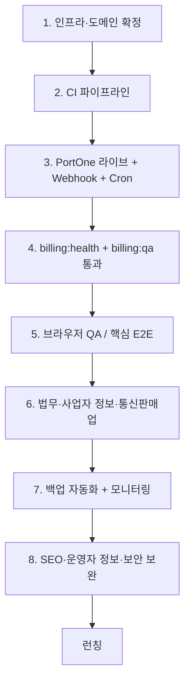

# Show Me The Plan — 실제 런칭 체크리스트

> **문서 목적:** PoC(실증) 단계에서 **실제 유료 서비스 런칭**까지 필요한 작업을 우선순위별로 정리한다.  
> **작성 기준일:** 2026-06-26  
> **대상:** Show Me The Plan (쇼미플) — Next.js 14 + Strapi 5 + PostgreSQL + Docker Compose + Caddy  
> **현재 PoC URL:** https://rmaker.duckdns.org (고정 IP PC 또는 동일 구조 서버)

**제외 범위:** 이메일 힌트(닉네임 → 마스킹 이메일) 기능은 간단히 구현·수정 완료 — 본 문서에서 별도 작업 항목으로 다루지 않음.

---

## 목차

1. [현재 상태 요약](#1-현재-상태-요약)
2. [런칭 권장 순서](#2-런칭-권장-순서)
3. [🔴 Blocker — 런칭 전 필수](#3--blocker--런칭-전-필수)
4. [🟡 High — 런칭 직전 권장](#4--high--런칭-직전-권장)
5. [🟢 Medium — 런칭 후 1~4주](#5--medium--런칭-후-14주)
6. [⚪ Low — 2차 로드맵](#6--low--2차-로드맵)
7. [런칭 당일 스모크 테스트](#7-런칭-당일-스모크-테스트)
8. [관련 문서 인덱스](#8-관련-문서-인덱스)

---

## 1. 현재 상태 요약

| 영역 | 상태 | 비고 |
|------|------|------|
| 핵심 기능 (일정·계획·TODO·통계·매니저·NEIS) | ✅ 완료 | 도메인 로직·UI 구현됨 |
| PWA (홈 화면 설치, standalone) | ✅ 완료 | `@ducanh2912/next-pwa` |
| 학습 TODO 푸시 알림 | ✅ 완료 | Web Push + Strapi cron (매분) |
| 사용법 가이드 (`/dashboard/guide/*`) | ✅ 콘텐츠 완료 | 스크린샷 placeholder → 실제 이미지 교체 검토 |
| 일정 인쇄 (주간·월간) | ✅ 구현됨 | 실제 프린트 QA 필요 |
| 결제·구독·Ops (`/billing`, `/ops`) | ✅ 코드 완료 | **프로덕션 env·계약 미완** |
| 약관·개인정보·유료약관 페이지 | ✅ 배포됨 | **법무 검토 별도** |
| 도메인 단위 테스트 | ✅ ~75개 | frontend + backend Vitest |
| CI/CD (GitHub Actions) | ❌ 없음 | `.github/workflows/` 부재 |
| E2E / 컴포넌트 테스트 | ❌ 없음 | Playwright 등 미도입 |
| 에러 바운더리 (`error.tsx`) | ❌ 없음 | Next.js 기본 오류 화면 |
| SEO (`robots.txt`, `sitemap`) | ❌ 없음 | 마케팅 페이지 노출 대비 필요 |
| 에러 모니터링 (Sentry 등) | ❌ 없음 | 문서상 2차 과제 |
| DB·업로드 자동 백업 | ❌ 없음 | 가이드에 수동 스크립트만 존재 |
| 이메일 알림 (체험·결제·갱신) | ⏸ 보류 | 1차 출시 범위 제외 (의도적) |

**한 줄 결론:** 제품 기능은 런칭 가능 수준이나, **결제 프로덕션 전환·법무·인프라·CI/CD·백업·모니터링**이 가장 큰 갭이다.

---

## 2. 런칭 권장 순서



---

## 3. 🔴 Blocker — 런칭 전 필수

### 3.1 인프라·도메인·배포 환경

현재 PoC는 고정 IP PC + Duck DNS 구조. 상용 런칭 시 **가용성·백업**을 위해 클라우드 VPS 이전을 권장한다.

- [ ] **호스팅 결정** — Hetzner CX23(4GB) + Docker Compose 권장 ([`CLOUD-DEPLOYMENT-REVIEW.md`](./CLOUD-DEPLOYMENT-REVIEW.md))
- [ ] **도메인 결정** — Duck DNS 유지 vs 자체 도메인 (브랜드·신뢰도)
- [ ] VPS 이전 절차 수행 ([`HETZNER-VPS-MIGRATION-GUIDE.md`](./HETZNER-VPS-MIGRATION-GUIDE.md))
- [ ] 루트 `.env` 프로덕션 값 작성 — 아래 항목 **전부** 강한 랜덤 값으로 교체
  - `APP_DOMAIN`, `NEXTAUTH_URL`, `CORS_ORIGIN`, `FRONTEND_URL`
  - `NEXTAUTH_SECRET`, Strapi 시크릿 5종 (`APP_KEYS`, `JWT_SECRET` 등)
  - `DATABASE_PASSWORD`
  - `BILLING_INTERNAL_SECRET`, `BILLING_ENCRYPTION_KEY`, `BILLING_CRON_SECRET`, `OPS_INTERNAL_SECRET`
- [ ] `docker compose up -d --build` 후 HTTPS·PWA manifest·Service Worker 200 확인
- [ ] **NEIS API 키** (`NEIS_KEY`) 운영 서버에 설정·쿼터 확인
- [ ] **Brevo SMTP** — 비밀번호 재설정 메일 발송 테스트 (`backend/scripts/test-send-email.mjs`)
- [ ] **VAPID 키** 생성·설정 (`npx web-push generate-vapid-keys`) — 푸시 알림용
- [ ] (선택) `UPLOAD_PROVIDER=s3` + R2/S3 — 단일 VPS 볼륨 대신 CDN·백업 용이

**Strapi Admin 포트 노출 주의:** `docker-compose.yml`에서 Strapi `1337`이 호스트에 노출됨. 운영 시 방화벽으로 관리자 IP만 허용하거나, 포트 매핑 제거 후 Caddy 내부 프록시만 사용 검토.

---

### 3.2 결제·구독 프로덕션 전환

코드는 완료. **PortOne 라이브 환경·스케줄러**가 미설정 상태.

상세: [`BILLING-PRODUCTION-GO-LIVE.md`](./BILLING-PRODUCTION-GO-LIVE.md), [`BILLING-QA-CHECKLIST.md`](./BILLING-QA-CHECKLIST.md)

- [ ] PortOne **가맹·빌링 채널** 계약·심사 완료
- [ ] PortOne **라이브** 키 발급·`.env` 등록
  - `PORTONE_API_SECRET`
  - `NEXT_PUBLIC_PORTONE_STORE_ID`
  - `NEXT_PUBLIC_PORTONE_CHANNEL_KEY`
  - `PORTONE_WEBHOOK_SECRET`
- [ ] `PORTONE_WEBHOOK_SKIP_VERIFY=false` (**운영 상시 `true` 금지**)
- [ ] Webhook URL 등록: `https://{도메인}/api/billing/webhooks/portone`
- [ ] 외부 cron → `npm run billing:cron` (하루 1~2회, KST 09:00 권장)
- [ ] Strapi cron 확인 — 구독 만료 `0 3 * * *`, 푸시 알림 `* * * * *` (매분)
- [ ] 배포 후 `npm run billing:health` → `"ready": true`
- [ ] `npm run billing:qa` — Skip 0건 목표 (PortOne 키·시크릿 일치)
- [ ] **실제 테스트 카드** 결제 E2E — 빌링키 → `active` → 결제 내역 표시
- [ ] Strapi Admin → Plan `student_monthly` **4,900원** 최종 확인
- [ ] 해지 예약·만료 → `/billing/expired` 리다이렉트 브라우저 확인

---

### 3.3 사업·법무

약관 페이지(`/legal/*`)는 배포되어 있으나 **법무 검토·사업자 정보**는 별도 확정 필요.

- [ ] **통신판매업 신고** (또는 일정 확정)
- [ ] **환불 정책** 확정 — 중도 해지, 7일 이내, 미사용 기간 등 → 약관·CS 매뉴얼과 정합
- [ ] `past_due` **grace period** 일수 확정 (예: 3일 / 7일) — 코드·약관·CS에 반영
- [ ] 약관·개인정보·유료서비스약관 **법무 검토** (포트원 PG 위탁 문구 포함)
- [ ] 푸터·약관 **운영자 정보** env 설정 ([`frontend/.env.example`](../frontend/.env.example))
  - `NEXT_PUBLIC_CONTACT_EMAIL`
  - `NEXT_PUBLIC_REPRESENTATIVE_NAME`
  - `NEXT_PUBLIC_BUSINESS_REG_NO`
  - `NEXT_PUBLIC_BUSINESS_ADDRESS`
- [ ] 미성년자 가입·결제 고지 (`guardianConsentConfirmedAt`) 법무 확인

---

### 3.4 운영자(Operator) 계정

CS·할인·매니저 승인에 필요. [`OPS-OPERATOR-SETUP.md`](./OPS-OPERATOR-SETUP.md)

- [ ] Strapi Admin에서 운영자 User + User Profile (`isOperator: true`) 생성
- [ ] `/ops` 대시보드·할인·매니저 승인 동작 확인
- [ ] `npm run ops:qa` Pass
- [ ] CS 매뉴얼 숙지 ([`BILLING-CS-MANUAL.md`](./BILLING-CS-MANUAL.md))

---

### 3.5 백업·복구

자동화 코드 없음 — **런칭 전 최소 1회 설정 필수**.

- [ ] PostgreSQL 일일 `pg_dump` cron + 7일 보관 ([`HETZNER-VPS-MIGRATION-GUIDE.md`](./HETZNER-VPS-MIGRATION-GUIDE.md) Phase 8)
- [ ] Strapi `uploads/` 주기 백업 (S3 미사용 시)
- [ ] **복구 리허설 1회** — 덤프 복원 + 앱 기동 확인
- [ ] `.env` 시크릿 안전한 곳에 백업 (비밀번호 관리자)

---

## 4. 🟡 High — 런칭 직전 권장

### 4.1 CI/CD 파이프라인

`.github/workflows/` 없음. 수동 배포만으로는 회귀 위험이 큼.

- [ ] GitHub Actions 워크플로 추가 (PR/merge 시)
  - `frontend`: `lint` + `vitest run` + `next build`
  - `backend`: `vitest run` + `strapi build`
  - (선택) `docker compose build`
- [ ] 루트 `package.json`에 통합 스크립트 추가 예: `test`, `lint`, `build`
- [ ] (선택) pre-commit 훅 — lint·test

---

### 4.2 브라우저 QA (자동 QA로 대체 불가)

[`BILLING-QA-CHECKLIST.md`](./BILLING-QA-CHECKLIST.md) Browser 섹션 + 아래 항목.

| 시나리오 | 확인 |
|----------|------|
| 학생 가입 → 14일 체험 → 대시보드 | [ ] |
| 체험 D-day 배너 표시 | [ ] |
| 체험/구독 만료 → `/billing/expired` | [ ] |
| 결제 → 구독 활성 → 대시보드 접근 | [ ] |
| 매니저 연결 → 학생 만료 시 배지·403 | [ ] |
| `/ops` 운영자 전용 (일반 계정 차단) | [ ] |
| PWA 홈 화면 설치 (Android Chrome, iOS Safari) | [ ] |
| 푸시 알림 구독·TODO 정각 알림 | [ ] |
| 비밀번호 찾기 → Brevo 메일 수신 | [ ] |
| 회원 탈퇴 → 데이터 삭제 | [ ] |

**최근 추가·변경 기능 수동 QA:**

| 영역 | 확인 |
|------|------|
| 사용법 가이드 (`/dashboard/guide/*`) | [ ] 네비·콘텐츠·링크 |
| 과목 태그 설정 (`/dashboard/preferences/subject-tags`) | [ ] 저장·색상·스케줄 반영 |
| 주간·월간 일정 인쇄 | [ ] 레이아웃·페이지 분할·인쇄 미리보기 |
| 일정 첨부 이미지 | [ ] 업로드·표시·권한 |

---

### 4.3 Critical path E2E 테스트 (권장)

단위 테스트 ~75개는 풍부하나 **결제·구독 차단** 경로는 E2E 없음. Playwright 5~10 시나리오 권장.

- [ ] 회원가입 → 체험 → 대시보드
- [ ] 만료 → middleware 리다이렉트
- [ ] 결제 → active → middleware 통과
- [ ] 매니저 → 만료 학생 관리 차단

---

### 4.4 보안 보완

보안 검토 기준: SQLi·XSS는 양호. 아래는 런치 전 검토 권장.

- [ ] **Rate limiting** — 회원가입, 로그인, NEIS 조회, `email-hint` API
- [ ] **첨부파일 IDOR** — 일정 첨부 이미지 URL 직접 접근 시 소유권 검증 여부 확인
- [ ] **Next.js 보안 헤더** — `next.config.mjs`에 `headers()` (CSP, X-Frame-Options 등)
- [ ] Strapi **1337 포트** 방화벽 제한
- [ ] Webhook 서명 검증 운영 설정 재확인

**구독 미들웨어 fallback:** Strapi 구독 조회 실패 시 `resolveStudentAccessAllowed`가 기본 `true`를 반환할 수 있음 (`frontend/src/middleware.ts`). fail-closed(차단) vs fail-open(허용) 정책을 명시적으로 결정·구현 검토.

---

### 4.5 에러·로딩 UX

- [ ] `frontend/src/app/dashboard/error.tsx` — 대시보드 런타임 오류 처리
- [ ] `frontend/src/app/dashboard/loading.tsx` — 전환 시 스켈레톤
- [ ] (선택) `global-error.tsx`

---

### 4.6 SEO·마케팅 기본

마케팅 페이지(`/`, `/for-students`, `/pricing` 등) 런칭 대상.

- [ ] `app/sitemap.ts` — 공개 페이지 URL 목록
- [ ] `app/robots.ts` — 크롤링 정책 (`/dashboard`, `/ops` 등 차단)
- [ ] Open Graph / Twitter Card 메타 (랜딩·pricing)
- [ ] (선택) GA4, Plausible 등 분석 도구

---

### 4.7 모니터링·알림

- [ ] Uptime 체크 (UptimeRobot 등) — `https://{도메인}`, `/api/billing/health`
- [ ] 서버 로그 확인 방법 문서화 — `[billing]`, `[cron]` prefix
- [ ] (권장) Sentry 또는 유사 도구 — 프론트·BFF `console.error` 수집
- [ ] 디스크·메모리 알림 (VPS)

---

### 4.8 닉네임 검증 정합성

UI 라벨은 "한글 3자 / 영문 6자" 안내가 있으나, 실제 검증은 **3자 이상 공통**만 적용됨. 런칭 전 정책 확정 후 폼·API·백엔드 일치 필요.

- [ ] 한글/영문 길이 규칙 확정
- [ ] `SignupForm`, `/api/register`, `updateMe` 검증 통일

---

### 4.9 접근성 (a11y)

- [ ] `viewport.maximumScale: 1` 제거 검토 — 저시력 사용자 확대 (WCAG)
- [ ] 주요 폼·모달 키보드·스크린리더 spot check

---

## 5. 🟢 Medium — 런칭 후 1~4주

### 5.1 문서·온보딩

- [ ] 루트 `README.md` — 로컬 개발·배포·QA 한 페이지 요약
- [ ] `frontend/README.md`, `backend/README.md` — 프로젝트 맞게 갱신
- [ ] `docs/PROJECT-OVERVIEW.md` — API 수·기능 목록 최신화

### 5.2 가이드·콘텐츠

- [ ] 가이드 스크린샷 placeholder → 실제 캡처 이미지 교체
- [ ] 마케팅 카피 최종 검수 (`docs/marketing-copy-*.md`)

### 5.3 이메일 알림 (Phase 3.6 — 보류 중)

1차 출시에서 의도적 제외. 푸시·앱 내 배너로 보완되는지 운영 중 확인.

- [ ] 체험 3일·1일·당일 남음
- [ ] 체험·구독 만료, 결제 성공·실패, 갱신 안내
- [ ] (선택) 매니저: 담당 학생 만료 알림

### 5.4 Ops 2차 (Ops-3)

- [ ] audit-log CT, 환불 UI, 체험 재부여, CSV export ([`MONETIZATION-OPS-ADMIN-PLAN.md`](./MONETIZATION-OPS-ADMIN-PLAN.md))

---

## 6. ⚪ Low — 2차 로드맵

| 항목 | 참고 |
|------|------|
| 연간 요금 (`student_yearly`) | Phase 0 미확정 |
| 쿠폰·프로모 코드 | Phase 5 |
| 환불 Admin UI + PG 환불 API | Phase 5, CS 매뉴얼 2차 |
| `past_due` 전용 Admin 독촉 리스트 | Phase 5 |
| 학교급별 차등 요금, B2B·세금계산서 | Phase 5 |
| 오프라인 PWA | [`PWA-IMPLEMENTATION.md`](./PWA-IMPLEMENTATION.md) |
| i18n 다국어 | 범위 외 |
| 앱스토어 네이티브 배포 | 범위 외 |
| Coolify / Railway 자동 배포 | 트래픽 증가 후 |
| Managed Postgres (Neon/RDS) | DB 분리·고가용 |

---

## 7. 런칭 당일 스모크 테스트

배포 직후 **10~15분** 버전. 상세는 [`BILLING-QA-CHECKLIST.md`](./BILLING-QA-CHECKLIST.md).

```bash
export NEXTAUTH_URL=https://your-domain.example.com
export BILLING_CRON_SECRET=your-cron-secret
npm run billing:health    # ready: true
npm run billing:qa        # Fail 0
npm run ops:qa            # Fail 0
```

| # | 확인 | Pass |
|---|------|------|
| 1 | `https://{도메인}` 랜딩 로드 | [ ] |
| 2 | 로그인·로그아웃 | [ ] |
| 3 | 학생 가입 → trialing | [ ] |
| 4 | `/pricing`, `/legal/paid-service` | [ ] |
| 5 | PWA manifest + sw.js 200 | [ ] |
| 6 | NEIS 학교 검색 (가입·시간표) | [ ] |
| 7 | 테스트 결제 → active (라이브 전 테스트 키 또는 소액) | [ ] |
| 8 | `/ops` 운영자 접근 | [ ] |
| 9 | 비밀번호 재설정 메일 | [ ] |
| 10 | 푸시 알림 1건 (설정 ON 후) | [ ] |

---

## 8. 관련 문서 인덱스

| 문서 | 용도 |
|------|------|
| [`PRODUCTION-LAUNCH-GUIDE.md`](./PRODUCTION-LAUNCH-GUIDE.md) | **Hetzner 배포 → PG 연결** 순차 실행 마스터 가이드 |
| [`PROJECT-OVERVIEW.md`](./PROJECT-OVERVIEW.md) | 기술·기능 전체 개요 |
| [`CLOUD-DEPLOYMENT-REVIEW.md`](./CLOUD-DEPLOYMENT-REVIEW.md) | 클라우드 아키텍처·비용 비교 |
| [`HETZNER-VPS-MIGRATION-GUIDE.md`](./HETZNER-VPS-MIGRATION-GUIDE.md) | VPS 이전 단계별 TodoList |
| [`BILLING-PRODUCTION-GO-LIVE.md`](./BILLING-PRODUCTION-GO-LIVE.md) | 결제 프로덕션 전환 |
| [`BILLING-QA-CHECKLIST.md`](./BILLING-QA-CHECKLIST.md) | 결제·구독 QA |
| [`BILLING-CS-MANUAL.md`](./BILLING-CS-MANUAL.md) | CS·할인·수동 연장 |
| [`MONETIZATION-IMPLEMENTATION-TODO.md`](./MONETIZATION-IMPLEMENTATION-TODO.md) | 유료화 구현 진행 상태 |
| [`OPS-OPERATOR-SETUP.md`](./OPS-OPERATOR-SETUP.md) | 운영자 계정 설정 |
| [`PWA-IMPLEMENTATION.md`](./PWA-IMPLEMENTATION.md) | PWA 구현 가이드 |
| [`PUSH-NOTIFICATION-DESIGN.md`](./PUSH-NOTIFICATION-DESIGN.md) | 푸시 알림 설계 |
| [`.env.example`](../.env.example) | 프로덕션 env 변수 목록 |

---

## 진행 상태 갱신

런칭 작업 진행 시 이 문서의 체크박스를 갱신하고, 완료일·담당·비고를 PR 또는 운영 노트에 남긴다.

*이메일 힌트(닉네임 조회)는 2026-06 구현 완료 — 본 체크리스트 범위 외.*
