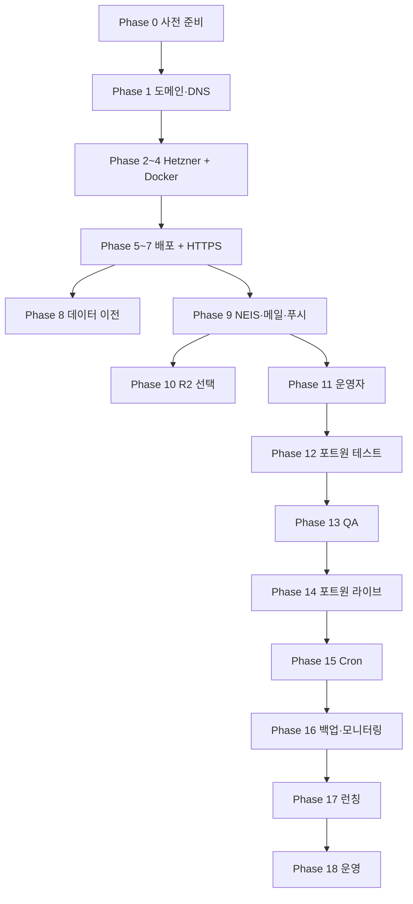

# Show Me The Plan — 실전 서비스 런칭 가이드

> **문서 목적:** PoC(자체 PC / Duck DNS)에서 **실제 유료 서비스 런칭**까지 필요한 작업을 **순서대로** 실행할 수 있도록 정리한 마스터 가이드  
> **작성 기준일:** 2026-06-26  
> **대상 스택:** Next.js 14 + Strapi 5 + PostgreSQL 16 + Docker Compose + Caddy  
> **PG:** 포트원 V2 (빌링키 자동결제)  
> **권장 인프라:** Hetzner Cloud VPS CX23 + (선택) Cloudflare DNS/R2

**이 문서 한 줄 요약**

> 계정·도메인 준비 → Hetzner VPS 배포 → HTTPS·외부 연동(NEIS·메일·푸시) → 운영자 설정 → 포트원 테스트 → 포트원 라이브 → cron·QA → 백업·모니터링 → 런칭

---

## 목차

1. [전체 로드맵](#1-전체-로드맵)
2. [Phase 0 — 사전 준비 (계정·법무·시크릿)](#phase-0--사전-준비-계정법무시크릿)
3. [Phase 1 — 도메인·DNS 계획](#phase-1--도메인dns-계획)
4. [Phase 2 — Hetzner VPS 생성](#phase-2--hetzner-vps-생성)
5. [Phase 3 — VPS 초기 설정](#phase-3--vps-초기-설정)
6. [Phase 4 — Docker 설치](#phase-4--docker-설치)
7. [Phase 5 — 프로젝트 배포](#phase-5--프로젝트-배포)
8. [Phase 6 — 프로덕션 `.env` 완성](#phase-6--프로덕션-env-완성)
9. [Phase 7 — DNS·HTTPS 전환](#phase-7--dnshttps-전환)
10. [Phase 8 — 데이터 이전 (선택)](#phase-8--데이터-이전-선택)
11. [Phase 9 — 외부 서비스 연동](#phase-9--외부-서비스-연동)
12. [Phase 10 — 이미지 스토리지 (선택: Cloudflare R2)](#phase-10--이미지-스토리지-선택-cloudflare-r2)
13. [Phase 11 — 운영자(Operator) 계정](#phase-11--운영자operator-계정)
14. [Phase 12 — 포트원 PG (테스트 환경)](#phase-12--포트원-pg-테스트-환경)
15. [Phase 13 — 결제·구독 QA (스테이징)](#phase-13--결제구독-qa-스테이징)
16. [Phase 14 — 포트원 PG (라이브 전환)](#phase-14--포트원-pg-라이브-전환)
17. [Phase 15 — Cron·스케줄러 설정](#phase-15--cron스케줄러-설정)
18. [Phase 16 — 백업·보안·모니터링](#phase-16--백업보안모니터링)
19. [Phase 17 — 런칭 당일 스모크 테스트](#phase-17--런칭-당일-스모크-테스트)
20. [Phase 18 — 구 PC 종료·운영 루틴](#phase-18--구-pc-종료운영-루틴)
21. [환경 변수 전체 참조표](#환경-변수-전체-참조표)
22. [트러블슈팅](#트러블슈팅)
23. [롤백 절차](#롤백-절차)
24. [관련 문서](#관련-문서)

---

## 1. 전체 로드맵



| 구간 | 예상 소요 | 병렬 가능 |
|------|-----------|-----------|
| Phase 0~1 (계정·도메인·법무 착수) | 1~14일 (PG 심사·통신판매업) | 포트원 계약은 Phase 2와 병행 |
| Phase 2~7 (Hetzner 배포·HTTPS) | 반나절~1일 | — |
| Phase 8 (데이터 이전) | 2~4시간 | Phase 9와 병행 가능 |
| Phase 9~11 (외부 연동·운영자) | 2~4시간 | — |
| Phase 12~15 (PG 테스트→라이브) | 1~2일 | 포트원 심사 완료 후 |
| Phase 16~17 (백업·런칭) | 반나절 | — |

**월 예상 비용 (최소 구성)**

| 항목 | 비용 |
|------|------|
| Hetzner CX23 (EU) | ~€3.99/월 |
| 도메인 (.com 등) | ~₩15,000/년 |
| Duck DNS | 무료 |
| Cloudflare (DNS/CDN) | 무료 |
| Cloudflare R2 (초기) | 무료 티어 내 |
| Brevo SMTP | 무료 티어 |
| NEIS API | 무료 (쿼터 확인) |
| 포트원 PG | 거래 수수료만 |
| **합계 (인프라)** | **약 €4 + 도메인** |

---

## Phase 0 — 사전 준비 (계정·법무·시크릿)

> **목표:** 서버를 만들기 전에 계정·법적 요건·시크릿 백업을 정리한다.  
> **포트원 가맹 심사**는 수 일~수 주 걸릴 수 있으므로 **가장 먼저 신청**한다.

### 0-1. 필수 계정 목록

- [ ] **Hetzner Cloud** — https://www.hetzner.com/cloud (결제 수단 등록)
- [ ] **GitHub** — 저장소 clone/Pull 권한 (private → PAT 또는 SSH 키)
- [ ] **도메인 등록기관** 또는 **Duck DNS** (PoC 유지 시)
- [ ] **Cloudflare** (권장) — DNS·CDN·R2
- [ ] **NEIS Open API** — https://open.neis.go.kr (학교·시간표)
- [ ] **Brevo** — https://www.brevo.com (SMTP, 비밀번호 재설정 메일)
- [ ] **포트원** — https://admin.portone.io (PG·빌링키)

### 0-2. 법무·사업 (런칭 전 확정 권장)

약관 페이지(`/legal/*`)는 이미 배포되어 있으나, **내용·사업자 정보는 별도 확정**이 필요하다.

- [ ] **통신판매업 신고** (또는 신고 일정 확정)
- [ ] **환불 정책** 확정 — 중도 해지, 7일 이내, 미사용 기간 등
- [ ] `past_due` **유예 기간** 일수 확정 (예: 3일 / 7일) — 약관·CS 매뉴얼과 정합
- [ ] 약관·개인정보·유료서비스약관 **법무 검토** (포트원 PG 위탁 문구 포함)
- [ ] 미성년자 가입·결제 고지 (`guardianConsentConfirmedAt`) 법무 확인
- [ ] 푸터·약관용 **사업자 정보** 준비 (Phase 6에서 env 반영)
  - 대표자명, 사업자등록번호, 사업장 주소, 문의 이메일

### 0-3. 기존 PoC 환경 백업

고정 IP PC에서 운영 중이라면 **시크릿·데이터를 반드시 백업**한다.

- [ ] 루트 `.env` 전체를 비밀번호 관리자에 저장
- [ ] **유지해야 할 시크릿** 목록 확인
  - `NEXTAUTH_SECRET`
  - Strapi 5종: `APP_KEYS`, `API_TOKEN_SALT`, `ADMIN_JWT_SECRET`, `TRANSFER_TOKEN_SALT`, `JWT_SECRET`
  - `DATABASE_PASSWORD`
  - `BILLING_INTERNAL_SECRET`, `BILLING_ENCRYPTION_KEY`, `BILLING_CRON_SECRET`, `OPS_INTERNAL_SECRET`
  - `NEIS_KEY`, Brevo SMTP, VAPID 키
- [ ] (데이터 이전 시) PostgreSQL 덤프
  ```bash
  docker compose exec postgres pg_dump -U strapi strapi > backup.sql
  ```
- [ ] (데이터 이전 시) Strapi uploads 백업
  ```bash
  docker compose cp strapi:/opt/app/public/uploads ./uploads-backup
  ```

### 0-4. 로컬 도구 확인

- [ ] SSH 클라이언트 (Windows: PowerShell `ssh`, PuTTY 등)
- [ ] `git`, `node` (로컬 QA 스크립트 실행용)
- [ ] (선택) `openssl rand -base64 32` — 새 시크릿 생성

**새 시크릿 생성 예시 (PoC에서 재사용하지 않을 경우)**

```bash
openssl rand -base64 32   # NEXTAUTH_SECRET
openssl rand -base64 32   # BILLING_INTERNAL_SECRET
openssl rand -base64 32   # BILLING_CRON_SECRET
openssl rand -base64 32   # OPS_INTERNAL_SECRET
# BILLING_ENCRYPTION_KEY — 32자 이상 임의 문자열
```

---

## Phase 1 — 도메인·DNS 계획

> **목표:** 사용자가 접속할 최종 URL을 확정한다.

### 1-1. 도메인 선택

| 옵션 | 장점 | 단점 |
|------|------|------|
| **Duck DNS 유지** (`rmaker.duckdns.org`) | 무료, PoC URL 그대로 | 브랜드 신뢰도 낮음 |
| **자체 도메인** (`showmetheplan.kr` 등) | 브랜드·신뢰도 | 연 비용 |
| **Cloudflare DNS** | CDN·R2·DDoS 무료 | DNS 이전 필요 |

- [ ] 최종 서비스 URL 확정: `https://________________`
- [ ] `APP_DOMAIN` 값 확정 (프로토콜 **없이** 호스트만, 예: `app.example.com`)

### 1-2. Cloudflare 사용 시 (권장)

- [ ] Cloudflare에 도메인 추가
- [ ] 등록기관 nameserver를 Cloudflare로 변경
- [ ] A 레코드: `@` → Hetzner VPS IPv4 (Phase 2에서 IP 확보 후)
- [ ] (선택) `cdn` 서브도메인 → R2 public URL (Phase 10)
- [ ] SSL/TLS: **Full** (Caddy가 Let's Encrypt 발급)

> Duck DNS만 쓸 경우 Phase 7에서 IP 업데이트.

---

## Phase 2 — Hetzner VPS 생성

> **목표:** 프로덕션 서버 1대를 만든다.  
> 상세: [`HETZNER-VPS-MIGRATION-GUIDE.md`](./HETZNER-VPS-MIGRATION-GUIDE.md) Phase 1

### 2-1. SSH 키 생성 (로컬 PC, 없을 경우)

```bash
ssh-keygen -t ed25519 -C "hetzner-show-me-the-plan"
cat ~/.ssh/id_ed25519.pub
```

- [ ] 공개키를 Hetzner Console → **Security → SSH Keys**에 등록

### 2-2. 프로젝트·서버 생성

- [ ] Hetzner Cloud Console → **New Project** (예: `show-me-the-plan`)
- [ ] **Add Server** 설정:

| 항목 | 권장 값 |
|------|---------|
| Location | Falkenstein (fsn1) 또는 Helsinki (hel1) — EU 최저가 |
| Image | Ubuntu **24.04** LTS |
| Type | **CX23** (2 vCPU, 4 GB RAM, 40 GB NVMe, ~€3.99/월) |
| Networking | IPv4 + IPv6 |
| SSH key | 위에서 등록한 키 |
| Name | `smp-prod` |

- [ ] Strapi 빌드 시 메모리 부족하면 **CX33** (8 GB)로 시작
- [ ] 서버 생성 후 **공인 IPv4** 기록: `________________`

### 2-3. Hetzner Cloud Firewall

- [ ] **Firewalls → Create Firewall**
- [ ] Inbound 규칙:

| 포트 | 프로토콜 | 소스 | 용도 |
|------|----------|------|------|
| 22 | TCP | 내 IP (가능하면) | SSH |
| 80 | TCP | 0.0.0.0/0, ::/0 | HTTP (Let's Encrypt) |
| 443 | TCP | 0.0.0.0/0, ::/0 | HTTPS |

- [ ] **1337 포트는 열지 않음** — Strapi Admin은 SSH 터널로만 접근
- [ ] Firewall을 서버에 적용

### 2-4. SSH 접속 확인

```bash
ssh root@<HETZNER_IP>
```

- [ ] 접속 성공 확인

---

## Phase 3 — VPS 초기 설정

> SSH 접속 후 서버에서 실행

### 3-1. 시스템 업데이트·타임존

```bash
apt update && apt upgrade -y
timedatectl set-timezone Asia/Seoul
```

- [ ] 완료

### 3-2. 배포 전용 사용자 생성 (권장)

```bash
adduser deploy
usermod -aG sudo deploy
rsync --archive --chown=deploy:deploy ~/.ssh /home/deploy
```

- [ ] 이후 `deploy` 사용자로 작업

### 3-3. Swap 추가 (CX23 4GB — 권장)

Strapi Docker **최초 빌드** 시 OOM 방지:

```bash
fallocate -l 2G /swapfile
chmod 600 /swapfile
mkswap /swapfile
swapon /swapfile
echo '/swapfile none swap sw 0 0' >> /etc/fstab
```

- [ ] `free -h`로 swap 확인

### 3-4. UFW 호스트 방화벽

```bash
ufw allow OpenSSH
ufw allow 80/tcp
ufw allow 443/tcp
ufw enable
ufw status
```

- [ ] 22, 80, 443만 허용 확인

---

## Phase 4 — Docker 설치

```bash
curl -fsSL https://get.docker.com | sh
usermod -aG docker deploy
systemctl enable docker
```

- [ ] `deploy` 사용자로 재로그인
- [ ] 확인:
  ```bash
  docker --version
  docker compose version
  ```

---

## Phase 5 — 프로젝트 배포

### 5-1. 저장소 clone

```bash
sudo -u deploy -i
cd ~
git clone <GITHUB_REPO_URL> show-me-the-plan
cd show-me-the-plan
git log -1
```

- [ ] private 저장소: HTTPS + PAT 또는 SSH clone
- [ ] 최신 커밋 확인

### 5-2. `.env` 파일 생성

```bash
cp .env.example .env
chmod 600 .env
nano .env
```

- [ ] Phase 6 항목을 채운 뒤 저장 (최소한 도메인·DB 비밀번호·Strapi 시크릿)

### 5-3. 최초 빌드·기동

```bash
docker compose up -d --build
```

- [ ] Strapi 최초 빌드 **10~15분** 소요 가능 — 정상
- [ ] 4개 서비스 `Up` 확인:
  ```bash
  docker compose ps
  # postgres, strapi, frontend, caddy
  ```
- [ ] 로그 확인:
  ```bash
  docker compose logs -f
  ```

### 5-4. Strapi Admin (새 DB일 경우만)

로컬 PC에서 SSH 터널:

```bash
ssh -L 1337:localhost:1337 deploy@<HETZNER_IP>
```

브라우저: `http://localhost:1337/admin`

- [ ] Super Admin 계정 생성
- [ ] (기존 DB 이전 시 이 단계 생략)

### 5-5. Strapi 1337 포트 노출 주의

`docker-compose.yml`에 Strapi `1337:1337` 매핑이 있다. 운영 시:

- [ ] Hetzner Firewall + UFW에서 **1337 미개방** 유지 (기본)
- [ ] (권장) 추후 compose에서 호스트 포트 매핑 제거 검토

---

## Phase 6 — 프로덕션 `.env` 완성

> **목표:** 루트 `.env` 한 파일이 Docker Compose 전체에 주입된다.  
> 참고: [`.env.example`](../.env.example)

### 6-1. 앱·도메인 (필수)

```env
APP_DOMAIN=your-domain.example.com
NEXTAUTH_URL=https://your-domain.example.com
CORS_ORIGIN=https://your-domain.example.com
FRONTEND_URL=https://your-domain.example.com
```

- [ ] `NEXTAUTH_URL` — `https` 포함, **끝에 `/` 없음**
- [ ] `APP_DOMAIN` — 프로토콜 없이 호스트만
- [ ] `CORS_ORIGIN` — 브라우저 Origin과 일치

### 6-2. NextAuth·Strapi 시크릿 (필수)

```env
NEXTAUTH_SECRET=<32바이트 이상 랜덤>
APP_KEYS=<key1>,<key2>
API_TOKEN_SALT=<랜덤>
ADMIN_JWT_SECRET=<랜덤>
TRANSFER_TOKEN_SALT=<랜덤>
JWT_SECRET=<랜덤>
```

- [ ] PoC에서 이전 시 **기존 값 유지** (세션·JWT 무효화 방지)
- [ ] 신규 런칭 시 모두 새로 생성

### 6-3. PostgreSQL (필수)

```env
DATABASE_NAME=strapi
DATABASE_USERNAME=strapi
DATABASE_PASSWORD=<강한 비밀번호>
```

### 6-4. NEIS (필수)

```env
NEIS_KEY=<open.neis.go.kr 발급 키>
NEIS_CACHE_ENABLED=true
NEIS_CACHE_TTL_HOURS=12
NEIS_CACHE_MAX_ENTRIES=2000
```

### 6-5. 이메일 — Brevo SMTP (필수)

```env
SMTP_HOST=smtp-relay.brevo.com
SMTP_PORT=587
SMTP_SECURE=false
BREVO_SMTP_USER=<id@smtp-brevo.com>
BREVO_SMTP_KEY=<xsmtpsib-...>
EMAIL_DEFAULT_FROM=<인증된 발신 주소>
EMAIL_DEFAULT_NAME=Show Me The Plan
```

- [ ] Brevo에서 발신 도메인/주소 인증 완료

### 6-6. Billing·Ops 내부 시크릿 (필수)

Strapi·Next.js **동일 값**이어야 한다.

```env
BILLING_INTERNAL_SECRET=<랜덤>
BILLING_ENCRYPTION_KEY=<32자 이상>
BILLING_CRON_SECRET=<랜덤>
OPS_INTERNAL_SECRET=<랜덤>
```

### 6-7. Web Push — VAPID (필수, 푸시 알림)

```bash
cd backend
npx web-push generate-vapid-keys
```

```env
VAPID_PUBLIC_KEY=<public>
VAPID_PRIVATE_KEY=<private>
VAPID_SUBJECT=mailto:support@your-domain.example.com
```

- [ ] `NEXT_PUBLIC_VAPID_PUBLIC_KEY`는 docker-compose가 `VAPID_PUBLIC_KEY`에서 자동 주입

### 6-8. PortOne (Phase 12~14에서 최종 확정)

```env
# 테스트 단계 (Phase 12)
PORTONE_API_SECRET=<테스트 API 시크릿>
NEXT_PUBLIC_PORTONE_STORE_ID=<테스트 스토어 ID>
NEXT_PUBLIC_PORTONE_CHANNEL_KEY=<테스트 채널 키>
PORTONE_WEBHOOK_SECRET=<웹훅 시크릿>
PORTONE_WEBHOOK_SKIP_VERIFY=true   # 테스트 중에만

# 라이브 전환 (Phase 14) — 아래 값으로 교체
# PORTONE_* → 라이브 키
# PORTONE_WEBHOOK_SKIP_VERIFY=false  ← 운영 필수
```

### 6-9. 업로드 스토리지

```env
# 로컬 (기본) — Caddy가 /uploads → Strapi 프록시
UPLOAD_PROVIDER=local

# R2 사용 시 (Phase 10)
# UPLOAD_PROVIDER=r2
# UPLOAD_S3_ACCESS_KEY_ID=...
# UPLOAD_S3_SECRET_ACCESS_KEY=...
# UPLOAD_S3_BUCKET=...
# UPLOAD_S3_REGION=auto
# UPLOAD_S3_ENDPOINT=https://<account-id>.r2.cloudflarestorage.com
# UPLOAD_S3_BASE_URL=https://cdn.your-domain.example.com
# NEXT_PUBLIC_UPLOAD_BASE_URL=https://cdn.your-domain.example.com
```

### 6-10. 프론트 사업자 정보 (런칭 전)

빌드 시점에 주입되므로 **frontend 재빌드** 필요.

[`frontend/.env.example`](../frontend/.env.example) 참고 — 루트 `.env`에 추가:

```env
NEXT_PUBLIC_CONTACT_EMAIL=support@your-domain.example.com
NEXT_PUBLIC_REPRESENTATIVE_NAME=홍길동
NEXT_PUBLIC_BUSINESS_REG_NO=000-00-00000
NEXT_PUBLIC_BUSINESS_ADDRESS=서울특별시 ...
```

### 6-11. Docker 빌드 시 `NEXT_PUBLIC_*` 변수 (중요)

Next.js는 `NEXT_PUBLIC_` 접두사 변수를 **`npm run build` 시점**에 클라이언트 번들에 박아 넣는다.  
`docker-compose.yml`의 `environment`만으로는 **빌드에 전달되지 않을 수 있음**.

`frontend` 서비스에 `build.args`를 추가한다 (아직 없다면):

```yaml
  frontend:
    build:
      context: ./frontend
      args:
        NEXT_PUBLIC_PORTONE_STORE_ID: ${NEXT_PUBLIC_PORTONE_STORE_ID:-}
        NEXT_PUBLIC_PORTONE_CHANNEL_KEY: ${NEXT_PUBLIC_PORTONE_CHANNEL_KEY:-}
        NEXT_PUBLIC_VAPID_PUBLIC_KEY: ${VAPID_PUBLIC_KEY:-}
        NEXT_PUBLIC_STRAPI_URL: ${NEXT_PUBLIC_STRAPI_URL:-${NEXTAUTH_URL}}
        NEXT_PUBLIC_UPLOAD_BASE_URL: ${NEXT_PUBLIC_UPLOAD_BASE_URL:-}
        NEXT_PUBLIC_CONTACT_EMAIL: ${NEXT_PUBLIC_CONTACT_EMAIL:-}
        NEXT_PUBLIC_REPRESENTATIVE_NAME: ${NEXT_PUBLIC_REPRESENTATIVE_NAME:-}
        NEXT_PUBLIC_BUSINESS_REG_NO: ${NEXT_PUBLIC_BUSINESS_REG_NO:-}
        NEXT_PUBLIC_BUSINESS_ADDRESS: ${NEXT_PUBLIC_BUSINESS_ADDRESS:-}
```

`frontend/Dockerfile` builder 스테이지에도 대응 `ARG` / `ENV`가 필요하다.  
(미반영 시 PortOne 체크아웃·푸시·사업자 정보가 브라우저에서 비어 있을 수 있음.)

### 6-12. env 변경 후 재배포

| 변경 항목 | 필요한 명령 |
|-----------|-------------|
| Strapi env | `docker compose up -d strapi` |
| `NEXTAUTH_URL`, PortOne public 키, 사업자 정보 | `docker compose up -d --build frontend` |
| `APP_DOMAIN` | `docker compose up -d caddy` |
| 전체 | `docker compose up -d --build` |

---

## Phase 7 — DNS·HTTPS 전환

### 7-1. DNS A 레코드

**Cloudflare 사용 시**

- [ ] A `@` → `<HETZNER_IP>` (Proxy: DNS only 또는 Proxied — Caddy Let's Encrypt와 충돌 시 **DNS only**로 시작)
- [ ] 전파 확인:
  ```bash
  nslookup your-domain.example.com
  ```

**Duck DNS 사용 시**

- [ ] https://www.duckdns.org → 도메인 IP를 Hetzner IPv4로 변경

### 7-2. `.env` 도메인 최종 확인

- [ ] `APP_DOMAIN`, `NEXTAUTH_URL`, `CORS_ORIGIN`, `FRONTEND_URL` 일치
- [ ] 재배포:
  ```bash
  docker compose up -d --build frontend
  docker compose up -d caddy
  ```

### 7-3. HTTPS 확인

```bash
docker compose logs caddy
```

- [ ] 브라우저 `https://your-domain.example.com` — 자물쇠 정상
- [ ] `http://` 접속 시 HTTPS 리다이렉트 확인

### 7-4. PoC PC 포트포워딩 해제

DNS 전환 완료 후:

- [ ] 구 PC 공유기 80/443 포트포워딩 **제거**

---

## Phase 8 — 데이터 이전 (선택)

> 기존 PoC에 사용자·일정 데이터가 있을 때만 수행

### 8-1. PostgreSQL 복원

```bash
# 로컬 PC → 서버
scp backup.sql deploy@<HETZNER_IP>:~/

# 서버
cd ~/show-me-the-plan
docker compose exec -T postgres psql -U strapi -d strapi < ~/backup.sql
docker compose restart strapi
```

### 8-2. uploads 이전 (로컬 스토리지 사용 시)

```bash
scp -r uploads-backup/* deploy@<HETZNER_IP>:~/uploads-backup/
cd ~/show-me-the-plan
docker compose cp ~/uploads-backup/. strapi:/opt/app/public/uploads/
```

### 8-3. 검증

- [ ] 기존 계정 로그인
- [ ] 일정·TODO·구독 데이터 확인

---

## Phase 9 — 외부 서비스 연동

### 9-1. NEIS API

- [ ] 가입·학교 검색·시간표 불러오기 동작
- [ ] NEIS 일일 쿼터·키 유효성 확인

### 9-2. Brevo 이메일 (비밀번호 재설정)

Strapi 컨테이너에서 테스트 (또는 로컬 backend):

```bash
docker compose exec strapi node scripts/test-send-email.mjs <수신이메일>
```

- [ ] 메일 수신 확인
- [ ] 스팸함 여부 확인

### 9-3. Web Push (학습 TODO 알림)

- [ ] 대시보드에서 푸시 알림 구독 ON
- [ ] TODO 알림 시각에 1건 수신 확인
- [ ] Strapi cron 매분 실행 확인:
  ```bash
  docker compose logs strapi | grep '\[cron\]'
  ```

### 9-4. PWA

- [ ] `https://your-domain.example.com/manifest.webmanifest` → 200
- [ ] `https://your-domain.example.com/sw.js` → 200
- [ ] Android Chrome / iOS Safari 홈 화면 추가 → standalone

### 9-5. 핵심 앱 기능

- [ ] 학생 가입 → 14일 `trialing`
- [ ] 로그인 / 로그아웃
- [ ] 대시보드·캘린더·TODO·통계
- [ ] 매니저 연결·승인
- [ ] 일정 첨부 이미지 업로드·표시

---

## Phase 10 — 이미지 스토리지 (선택: Cloudflare R2)

> 런칭 전 필수는 아니나, **백업·CDN·VPS 디스크** 측면에서 프로덕션 권장.  
> **실전 적용 상세 (2026-07):** [`R2-IMAGE-STORAGE-SETUP.md`](./R2-IMAGE-STORAGE-SETUP.md) — `plan-media.odap-coach.com`, 로컬·VPS 절차·체크리스트.

### 10-1. R2 버킷 생성

- [ ] Cloudflare Dashboard → R2 → Create bucket
- [ ] R2 API 토큰 생성 (Object Read & Write)
- [ ] (권장) 커스텀 도메인 `cdn.your-domain.example.com` 연결

### 10-2. `.env` 설정

```env
UPLOAD_PROVIDER=r2
UPLOAD_S3_ACCESS_KEY_ID=<R2 access key>
UPLOAD_S3_SECRET_ACCESS_KEY=<R2 secret>
UPLOAD_S3_BUCKET=show-me-the-plan
UPLOAD_S3_REGION=auto
UPLOAD_S3_ENDPOINT=https://<account-id>.r2.cloudflarestorage.com
UPLOAD_S3_BASE_URL=https://cdn.your-domain.example.com
NEXT_PUBLIC_UPLOAD_BASE_URL=https://cdn.your-domain.example.com
```

- [ ] Strapi 재시작: `docker compose up -d --build strapi`
- [ ] frontend 재빌드: `docker compose up -d --build frontend`

### 10-3. 기존 uploads 마이그레이션

- [ ] `uploads-backup/` 파일을 R2 버킷에 업로드 (rclone, aws cli 등)
- [ ] DB에 저장된 `/uploads/...` URL이 그대로 동작하는지 확인

### 10-4. 검증

- [ ] 새 일정 첨부 이미지 업로드
- [ ] 이미지 URL이 `cdn.` 도메인으로 표시
- [ ] Caddy `/uploads` 프록시 없이도 표시됨

---

## Phase 11 — 운영자(Operator) 계정

> CS·할인·매니저 승인용. 상세: [`OPS-OPERATOR-SETUP.md`](./OPS-OPERATOR-SETUP.md)

### 11-1. Strapi Admin에서 생성

SSH 터널 → `http://localhost:1337/admin`

1. **Content Manager → User** — 새 사용자 (role: `Authenticated`)
2. **Content Manager → User Profile**
   - `user`: 위 사용자 연결
   - `isOperator`: **true**
   - `schoolLevel`: `other`

### 11-2. 앱 확인

- [ ] `https://your-domain.example.com/login` — 운영자 로그인
- [ ] `/ops` 대시보드 접근
- [ ] 일반 학생 계정 → `/ops` 차단 (대시보드로 리다이렉트)
- [ ] Profile 생성 후 **재로그인** (JWT에 `isOperator` 반영)

### 11-3. 자동 QA

```bash
export NEXTAUTH_URL=https://your-domain.example.com
export OPS_INTERNAL_SECRET=<.env와 동일>
npm run ops:qa
```

- [ ] **Fail 0** 목표

---

## Phase 12 — 포트원 PG (테스트 환경)

> **목표:** 라이브 전환 전, **테스트 키**로 결제 E2E를 완료한다.  
> 상세: [`BILLING-PORTONE-MIGRATION-TODO.md`](./BILLING-PORTONE-MIGRATION-TODO.md), [`BILLING-PRODUCTION-GO-LIVE.md`](./BILLING-PRODUCTION-GO-LIVE.md)

### 12-1. 포트원 계정·가맹 (병행 — 심사에 시간 소요)

- [ ] https://admin.portone.io 가입
- [ ] **사업자 정보** 등록
- [ ] **정기결제(빌링키)** 채널 신청 — 하위 PG 선택 (나이스·토스·KG 등, 수수료·심사 기간 비교)
- [ ] **테스트 스토어** 생성

### 12-2. 테스트 채널·키 발급

포트원 콘솔에서 확인:

- [ ] **Store ID** → `NEXT_PUBLIC_PORTONE_STORE_ID`
- [ ] **API Secret** (테스트) → `PORTONE_API_SECRET`
- [ ] **채널 키** (빌링키 발급용) → `NEXT_PUBLIC_PORTONE_CHANNEL_KEY`

### 12-3. `.env` 반영 (테스트)

```env
PORTONE_API_SECRET=<테스트>
NEXT_PUBLIC_PORTONE_STORE_ID=<테스트>
NEXT_PUBLIC_PORTONE_CHANNEL_KEY=<테스트>
PORTONE_WEBHOOK_SECRET=<콘솔에서 발급>
PORTONE_WEBHOOK_SKIP_VERIFY=true
```

```bash
docker compose up -d --build frontend strapi
```

### 12-4. Webhook 등록 (테스트)

1. [포트원 Webhook 관리 (V2)](https://admin.portone.io/integration-v2/manage/webhook?version=V2)
2. **웹훅 시크릿** 발급 → `PORTONE_WEBHOOK_SECRET`
3. Webhook URL 등록:
   ```
   https://your-domain.example.com/api/billing/webhooks/portone
   ```

- [ ] HTTPS 공개 URL 필수 (로컬 tunnel 불가 시 VPS 배포 후 등록)

### 12-5. Strapi Plan 확인

SSH 터널 → Strapi Admin → **Plan**

- [ ] `student_monthly` — **4,900원** 확인

### 12-6. Health check

로컬 PC 또는 VPS:

```bash
export NEXTAUTH_URL=https://your-domain.example.com
export BILLING_CRON_SECRET=<.env 값>
npm run billing:health
```

- [ ] exit `0`, `"ready": true`
- [ ] 응답의 `webhookUrl`, `cronUrl` 기록

### 12-7. 테스트 카드 결제 E2E (브라우저)

1. 학생 계정 로그인 (trialing)
2. `/billing/checkout` 또는 설정 → 구독·결제
3. 포트원 **테스트 카드**로 빌링키 발급·첫 결제
4. 구독 상태 `active` 확인
5. `/dashboard/settings/billing/history` — 정가·할인·실결제액 표시
6. 서버 로그:
   ```bash
   docker compose logs frontend | grep '\[billing\]'
   ```
   - [ ] `webhook.payment_succeeded` 확인

### 12-8. 해지·만료 시나리오 (테스트)

- [ ] 해지 예약 → 기간 종료까지 이용 가능
- [ ] 만료 후 `/dashboard` → `/billing/expired` 리다이렉트
- [ ] 매니저 → 만료 학생 배지·403

---

## Phase 13 — 결제·구독 QA (스테이징)

> 상세: [`BILLING-QA-CHECKLIST.md`](./BILLING-QA-CHECKLIST.md)

### 13-1. 자동 QA

```bash
export NEXTAUTH_URL=https://your-domain.example.com
export BILLING_CRON_SECRET=<.env 값>
npm run billing:qa
npm run billing:manual-qa
npm run ops:qa
```

- [ ] `billing:qa` — **Fail 0**, Skip은 env 미설정 항목만
- [ ] `ops:qa` — **Fail 0**

### 13-2. 수동 QA (브라우저 — 자동 대체 불가)

| 시나리오 | Pass |
|----------|------|
| 학생 가입 → 14일 체험 → 대시보드 | [ ] |
| 체험 D-day 배너 | [ ] |
| 체험/구독 만료 → `/billing/expired` | [ ] |
| 테스트 카드 결제 → active | [ ] |
| Admin 20% 할인 (`/ops`) → 다음 청구액 반영 | [ ] |
| 0원·overridePrice → PG 생략 | [ ] |
| 해지 예약 → 기간 종료 후 만료 | [ ] |
| 매니저 → 만료 학생 403 | [ ] |
| `/pricing`, `/legal/paid-service` | [ ] |
| Webhook 중복 수신 idempotent | [ ] |

### 13-3. Cron 수동 1회

```bash
npm run billing:cron
```

- [ ] 로그 `[billing] cron.renewal_finished` 확인

---

## Phase 14 — 포트원 PG (라이브 전환)

> **전제:** 포트원 **라이브 가맹·채널 심사 완료**, 스테이징 QA Pass

### 14-1. 라이브 키로 `.env` 교체

| 변수 | 운영 값 |
|------|---------|
| `PORTONE_API_SECRET` | **라이브** API 시크릿 |
| `NEXT_PUBLIC_PORTONE_STORE_ID` | **라이브** 스토어 ID |
| `NEXT_PUBLIC_PORTONE_CHANNEL_KEY` | **라이브** 채널 키 |
| `PORTONE_WEBHOOK_SECRET` | 라이브 웹훅 시크릿 |
| `PORTONE_WEBHOOK_SKIP_VERIFY` | **`false`** (상시 `true` 금지) |

```bash
docker compose up -d --build frontend strapi
```

### 14-2. 라이브 Webhook URL 등록

```
https://your-domain.example.com/api/billing/webhooks/portone
```

- [ ] 테스트 Webhook과 별도로 라이브 스토어에 등록
- [ ] `PORTONE_WEBHOOK_SKIP_VERIFY=false` 확인

### 14-3. Health 재확인

```bash
export NEXTAUTH_URL=https://your-domain.example.com
export BILLING_CRON_SECRET=<.env 값>
npm run billing:health
```

- [ ] `"ready": true`

### 14-4. 라이브 소액 결제 검증

- [ ] 본인 카드로 **실제 4,900원** (또는 할인 적용가) 결제 1건
- [ ] 포트원 콘솔·앱 결제 내역·Strapi Subscription 일치
- [ ] Webhook 로그 `payment_succeeded` 확인

### 14-5. CS·운영 준비

- [ ] [`BILLING-CS-MANUAL.md`](./BILLING-CS-MANUAL.md) 숙지
- [ ] 환불·해지·수동 연장 절차 확인
- [ ] `/ops` 할인·매니저 승인 최종 테스트

---

## Phase 15 — Cron·스케줄러 설정

### 15-1. Strapi 내장 cron (Docker 상주 — 별도 설정 불필요)

`backend/config/cron.ts`:

| 스케줄 | 작업 |
|--------|------|
| `* * * * *` (매분) | 학습 TODO 푸시 알림 |
| `0 3 * * *` (매일 03:00 KST) | 구독 만료 처리 (`expireDueSubscriptions`) |

- [ ] Strapi 컨테이너가 24시간 실행 중인지 확인
- [ ] `docker compose logs strapi | grep cron` 으로 동작 확인

### 15-2. Billing 갱신 cron (VPS crontab — 필수)

Next.js BFF `POST /api/billing/cron/run` — **하루 1~2회** 호출.

**VPS에서 crontab 등록 (`deploy` 사용자):**

```bash
crontab -e
```

```cron
# 매일 09:00 KST — 구독 자동 갱신
0 9 * * * NEXTAUTH_URL=https://your-domain.example.com BILLING_CRON_SECRET=<시크릿> /usr/bin/node /home/deploy/show-me-the-plan/scripts/run-billing-cron.mjs >> /var/log/smp-billing-cron.log 2>&1
```

- [ ] 로그 파일 권한·경로 확인
- [ ] 수동 1회 실행 후 exit 0:
  ```bash
  NEXTAUTH_URL=https://your-domain.example.com BILLING_CRON_SECRET=<시크릿> npm run billing:cron
  ```

### 15-3. Cron 누락 대비

- [ ] UptimeRobot 등으로 `/api/billing/health` 주기 체크
- [ ] cron 실패 시 수동 `npm run billing:cron` 절차 문서화

---

## Phase 16 — 백업·보안·모니터링

### 16-1. PostgreSQL 자동 백업

> **R2 off-site 백업 (권장, 2026-07 적용):** [`R2-DB-BACKUP-SETUP.md`](./R2-DB-BACKUP-SETUP.md) — `backup-db-to-r2.sh`, cron, 90일 Lifecycle.

`~/backup-db.sh` (로컬 디스크만):

```bash
#!/bin/bash
cd ~/show-me-the-plan
FILE=~/backups/strapi-$(date +%Y%m%d-%H%M).sql
docker compose exec -T postgres pg_dump -U strapi strapi > "$FILE"
find ~/backups -name "strapi-*.sql" -mtime +7 -delete
```

```bash
mkdir -p ~/backups
chmod +x ~/backup-db.sh
crontab -e
# 0 3 * * * /home/deploy/backup-db.sh
```

- [ ] **복구 리허설 1회** — 덤프 복원 + 앱 기동

### 16-2. uploads 백업 (로컬 스토리지 사용 시)

```bash
# 주 1회
docker compose exec strapi tar czf - /opt/app/public/uploads > ~/backups/uploads-$(date +%Y%m%d).tar.gz
```

R2 사용 시 uploads 백업은 R2 수명 주기 정책으로 대체 가능.

### 16-3. 보안

- [ ] SSH 비밀번호 로그인 비활성 (`PasswordAuthentication no`)
- [ ] `.env` 권한 `600`
- [ ] Strapi Admin — SSH 터널만 (`ssh -L 1337:localhost:1337`)
- [ ] `PORTONE_WEBHOOK_SKIP_VERIFY=false` 재확인
- [ ] (권장) fail2ban 설치

### 16-4. 모니터링

- [ ] UptimeRobot — `https://your-domain.example.com`
- [ ] UptimeRobot — `https://your-domain.example.com/api/billing/health` (헤더 `x-billing-cron-secret`)
- [ ] Hetzner Console 알림 이메일
- [ ] `df -h`, `free -h` 주기 확인

### 16-5. 로그 확인 방법

```bash
docker compose logs -f frontend | grep '\[billing\]'
docker compose logs -f strapi | grep '\[cron\]'
```

| 로그 | 의미 |
|------|------|
| `[billing] cron.renewal_started` | 갱신 cron 시작 |
| `[billing] cron.renewal_finished` | 갱신 cron 완료 |
| `[billing] webhook.payment_succeeded` | Webhook 결제 성공 |
| `[billing] webhook.signature_invalid` | Webhook 서명 실패 — 즉시 조사 |

---

## Phase 17 — 런칭 당일 스모크 테스트

배포 직후 **10~15분** 버전.

```bash
export NEXTAUTH_URL=https://your-domain.example.com
export BILLING_CRON_SECRET=<시크릿>
npm run billing:health    # ready: true
npm run billing:qa          # Fail 0
npm run ops:qa              # Fail 0
```

| # | 확인 | Pass |
|---|------|------|
| 1 | `https://your-domain.example.com` 랜딩 | [ ] |
| 2 | 로그인·로그아웃 | [ ] |
| 3 | 학생 가입 → trialing | [ ] |
| 4 | `/pricing`, `/legal/paid-service` | [ ] |
| 5 | PWA manifest + sw.js 200 | [ ] |
| 6 | NEIS 학교 검색 | [ ] |
| 7 | 실결제 또는 라이브 직전 테스트 결제 → active | [ ] |
| 8 | `/ops` 운영자 접근 | [ ] |
| 9 | 비밀번호 재설정 메일 | [ ] |
| 10 | 푸시 알림 1건 | [ ] |
| 11 | `docker compose ps` — 4서비스 Up | [ ] |
| 12 | billing cron crontab 등록 확인 | [ ] |

---

## Phase 18 — 구 PC 종료·운영 루틴

### 18-1. PoC PC 종료

- [ ] Hetzner **24시간 이상** 안정 운영 확인
- [ ] 구 PC `docker compose down`
- [ ] DNS가 Hetzner IP를 가리키는지 재확인

### 18-2. 코드 업데이트 루틴

**개발 PC:**

```bash
git add .
git commit -m "..."
git push
```

**Hetzner VPS:**

```bash
cd ~/show-me-the-plan
git pull
docker compose up -d --build frontend   # frontend만 변경
# docker compose up -d --build            # backend도 변경
```

### 18-3. 월 1회 정기 점검

- [ ] `apt update && apt upgrade -y`
- [ ] `docker compose pull` (postgres, caddy 이미지)
- [ ] `ls ~/backups/` 백업 파일 존재
- [ ] `df -h` 디스크
- [ ] Hetzner 청구서
- [ ] 포트원 정산·Webhook 오류 로그

---

## 환경 변수 전체 참조표

| 변수 | 필수 | 설명 |
|------|------|------|
| `APP_DOMAIN` | ✅ | Caddy 도메인 (호스트만) |
| `NEXTAUTH_URL` | ✅ | 공개 URL (`https://...`) |
| `NEXTAUTH_SECRET` | ✅ | NextAuth 세션 암호화 |
| `CORS_ORIGIN` | ✅ | Strapi CORS (쉼표 구분 가능) |
| `FRONTEND_URL` | ✅ | Strapi 이메일 링크용 |
| `APP_KEYS` | ✅ | Strapi (쉼표 2개 이상) |
| `API_TOKEN_SALT` | ✅ | Strapi |
| `ADMIN_JWT_SECRET` | ✅ | Strapi Admin |
| `TRANSFER_TOKEN_SALT` | ✅ | Strapi |
| `JWT_SECRET` | ✅ | Strapi Users |
| `DATABASE_*` | ✅ | PostgreSQL |
| `NEIS_KEY` | ✅ | NEIS Open API |
| `BREVO_SMTP_*` | ✅ | 비밀번호 재설정 메일 |
| `EMAIL_DEFAULT_*` | ✅ | 발신 정보 |
| `BILLING_INTERNAL_SECRET` | ✅ | Strapi ↔ Next.js |
| `BILLING_ENCRYPTION_KEY` | ✅ | 빌링키 암호화 (32자+) |
| `BILLING_CRON_SECRET` | ✅ | 갱신 cron 인증 |
| `OPS_INTERNAL_SECRET` | ✅ | `/api/ops/internal/*` |
| `VAPID_*` | ✅ | Web Push |
| `PORTONE_*` | ✅ (유료) | PG |
| `UPLOAD_*` | 선택 | R2/S3 |
| `NEXT_PUBLIC_*` | 일부 | 빌드 시 주입 (사업자 정보, PortOne store) |

전체 템플릿: [`.env.example`](../.env.example)

---

## 트러블슈팅

| 증상 | 원인 | 해결 |
|------|------|------|
| `docker compose build` OOM | 4GB RAM 부족 | swap 추가(Phase 3-3) 또는 CX33 |
| HTTPS 인증서 실패 | DNS 미전파 / 80 차단 | nslookup, 방화벽 80·443 |
| 로그인 안 됨 | `NEXTAUTH_URL` 불일치 | `.env` 확인 → `docker compose up -d --build frontend` |
| CORS 오류 | `CORS_ORIGIN` 누락 | 공개 URL과 일치시키기 |
| 결제 UI 안 뜸 | PortOne public 키 미설정 | frontend 재빌드 |
| Webhook 401 | `PORTONE_WEBHOOK_SECRET` 불일치 | 콘솔 시크릿 재발급·env 동기화 |
| `billing:health` ready false | env 누락 | `checks` 배열의 error 항목 수정 |
| 푸시 안 옴 | VAPID·구독 미등록 | 브라우저 권한, Strapi cron 로그 |
| 이미지 404 (R2) | `NEXT_PUBLIC_UPLOAD_BASE_URL` | frontend 재빌드 |
| 한국에서 느림 | EU 리전 RTT | Cloudflare CDN, Singapore 리전 검토 |

---

## 롤백 절차

1. 포트원 **테스트** 키로 `.env` 되돌리기 또는 Webhook 비활성화
2. `PORTONE_WEBHOOK_SKIP_VERIFY=true` — **긴급 임시만**, 상시 사용 금지
3. Strapi Admin에서 Subscription 수동 연장 — [`BILLING-CS-MANUAL.md`](./BILLING-CS-MANUAL.md)
4. DNS를 구 PC IP로 되돌리기 (최후 수단)
5. DB 복원: `~/backups/strapi-*.sql`

---

## 관련 문서

| 문서 | 용도 |
|------|------|
| [`LAUNCH-CHECKLIST.md`](./LAUNCH-CHECKLIST.md) | 런칭 우선순위·갭 요약 |
| [`HETZNER-VPS-MIGRATION-GUIDE.md`](./HETZNER-VPS-MIGRATION-GUIDE.md) | VPS 이전 상세 (본 문서 Phase 2~8 확장) |
| [`BILLING-PRODUCTION-GO-LIVE.md`](./BILLING-PRODUCTION-GO-LIVE.md) | 결제 프로덕션 전환 요약 |
| [`BILLING-QA-CHECKLIST.md`](./BILLING-QA-CHECKLIST.md) | 결제·구독 QA 시나리오 |
| [`BILLING-PORTONE-MIGRATION-TODO.md`](./BILLING-PORTONE-MIGRATION-TODO.md) | 포트원 코드·계약 TODO |
| [`BILLING-CS-MANUAL.md`](./BILLING-CS-MANUAL.md) | CS·할인·수동 연장 |
| [`OPS-OPERATOR-SETUP.md`](./OPS-OPERATOR-SETUP.md) | 운영자 계정 |
| [`CLOUD-DEPLOYMENT-REVIEW.md`](./CLOUD-DEPLOYMENT-REVIEW.md) | 클라우드 옵션 비교 |
| [`R2-IMAGE-STORAGE-SETUP.md`](./R2-IMAGE-STORAGE-SETUP.md) | Cloudflare R2 이미지 (로컬·VPS) |
| [`R2-DB-BACKUP-SETUP.md`](./R2-DB-BACKUP-SETUP.md) | Cloudflare R2 DB 백업 (cron) |
| [`R2-CLOUDFLARE-SETUP-SUMMARY.md`](./R2-CLOUDFLARE-SETUP-SUMMARY.md) | R2 이미지 + DB 백업 한눈에 |
| [`.env.example`](../.env.example) | 환경 변수 템플릿 |

---

## 진행 상태 기록

작업 진행 시 아래 표에 날짜·담당·비고를 기록한다.

| Phase | 완료일 | 담당 | 비고 |
|-------|--------|------|------|
| 0 | | | |
| 1 | | | |
| 2~4 | | | |
| 5~7 | | | |
| 8 | | | |
| 9~10 | | | |
| 11 | | | |
| 12~13 | | | |
| 14~15 | | | |
| 16~17 | | | |
| 18 | | | |

*이메일 알림(체험·결제·갱신)은 1차 출시 범위에서 의도적으로 제외됨 — 푸시·앱 내 배너로 보완.*
