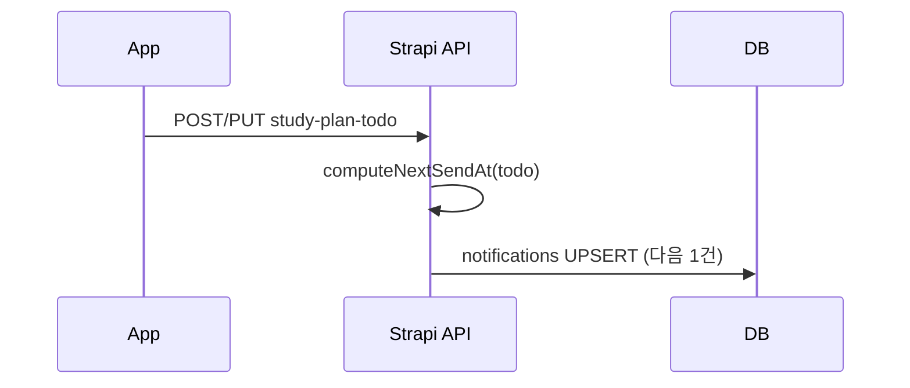
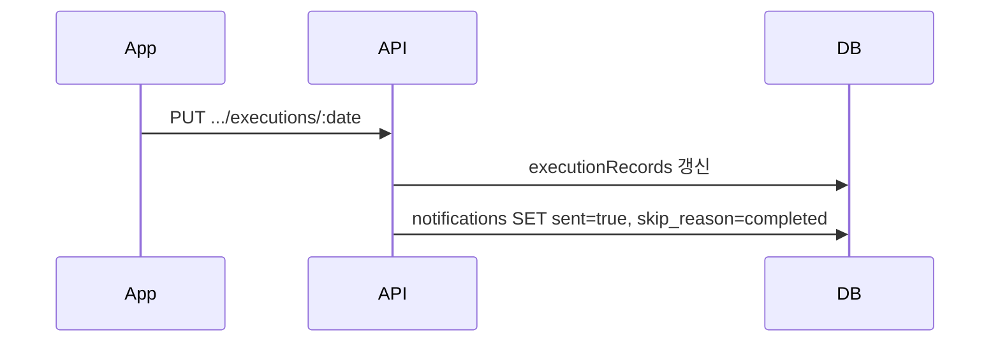
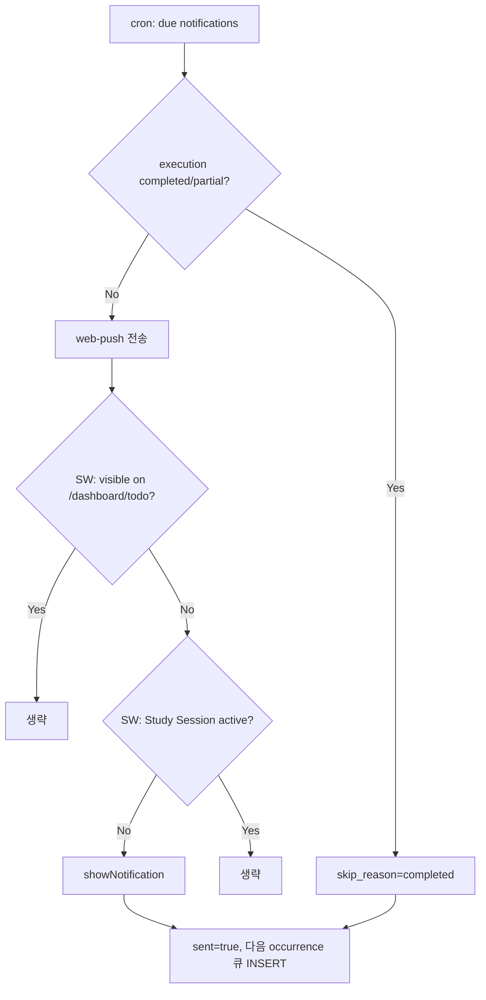
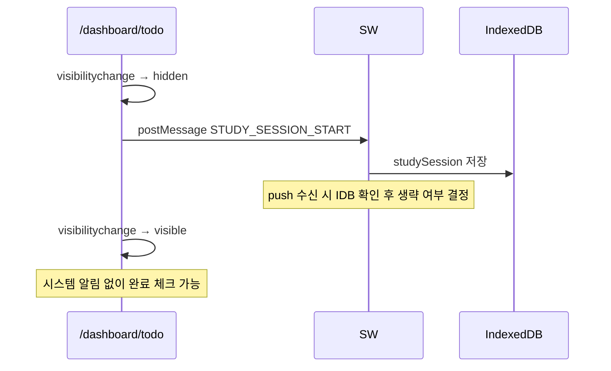

# Show Me The Plan — 학습 TODO 푸시 알람 설계

> **문서 목적:** PWA Web Push 기반 학습 TODO 알람 기능의 검토 결과를 통합 정리한다.  
> **작성 기준일:** 2026-06-25  
> **최종 갱신:** 2026-06-25 (정책 확정)  
> **상태:** 정책 확정 · 구현 대기  
> **관련 문서:** [PWA-IMPLEMENTATION.md](./PWA-IMPLEMENTATION.md), [PROJECT-OVERVIEW.md](./PROJECT-OVERVIEW.md)

---

## 목차

1. [요약](#1-요약)
2. [배경 및 목표](#2-배경-및-목표)
3. [기술적 가능 여부](#3-기술적-가능-여부)
4. [알림 큐 설계 (DB 부담 최소화)](#4-알림-큐-설계-db-부담-최소화)
5. [알람 억제 정책](#5-알람-억제-정책)
6. [Study Session (화면 OFF + 앱 유지)](#6-study-session-화면-off--앱-유지)
7. [데이터 모델](#7-데이터-모델)
8. [처리 흐름](#8-처리-흐름)
9. [구현 범위 및 파일](#9-구현-범위-및-파일)
10. [플랫폼 제약](#10-플랫폼-제약)
11. [확정 정책](#11-확정-정책)
12. [구현 TODO 리스트](#12-구현-todo-리스트)

---

## 1. 요약

| 항목 | 결론 |
|------|------|
| PWA로 TODO 시간 알람 | **가능** (서버 Web Push + Service Worker) |
| 알람 문구 | `[과목] 제목` — 학습할 시간입니다 |
| DB 설계 | **알림 큐** — TODO당 다음 1회 occurrence만 materialize |
| cron | `send_at <= NOW() AND sent = false` 인덱스 조회만 |
| 피해야 할 설계 | 매분 전체 사용자·전체 TODO occurrence 전개 |
| 알람 감소 | completed/partial skip + Study Session + foreground skip |
| 알람 시각 | `startTime` **정각** (`Asia/Seoul`) |
| 타이머 억제 | **구현 안 함** |
| 알림 전역 OFF | **제공** (`notifications_enabled`) |

**핵심 원칙:** 서버는 “보낼 시각이 된 알림”만 DB에서 꺼내고, “보내지 말아야 할 상황”은 서버·SW 양쪽 게이트로 판단한다.

---

## 2. 배경 및 목표

### 2.1 기능 요구

- 각 학생별 `study_plan_todos`에 계획된 과목·시간이 되면 알람 전송
- 과목 표시명은 기존 `getSubjectLabel()` 로직 재사용
- 예시: **「[수학] 문제집 3장 — 학습할 시간입니다」**

### 2.2 비기능 요구

- 사용자 1,000~10,000명 규모에서도 **불필요한 DB 부하 없음**
- **잦은·중복 알람으로 사용자 피로 최소화**
- 기존 TODO 모델(`weekly`/`once`, `excludedDates`, `overrides`, `executionRecords`)과 정합

### 2.3 현재 코드베이스 상태

| 항목 | 상태 |
|------|------|
| PWA (manifest, SW) | ✅ 구현됨 (`@ducanh2912/next-pwa`) |
| Web Push / VAPID | ❌ 미구현 |
| Push 구독 API | ❌ 미구현 |
| 알림 큐 테이블 | ❌ 미구현 |
| `study_plan_todos.executionRecords` | ✅ 구현됨 (occurrence별 완료 기록) |
| 타이머 (`StudyPlanTodoExecutionModal`) | ✅ 구현됨 (로컬 state, 저장 전 서버 미전달) |
| Strapi cron | ✅ 구독 만료만 (`0 3 * * *`) |

---

## 3. 기술적 가능 여부

### 3.1 알람 방식 비교

| 방식 | 백그라운드/잠금 화면 | DB 부담 | 판단 |
|------|---------------------|---------|------|
| **서버 Web Push** | ✅ | 낮음 (설계에 따라) | **채택** |
| 클라이언트 `setTimeout` | ❌ (앱 열릴 때만) | 없음 | 비실용 |
| Notification Triggers API | 이론상 ✅ | 없음 | **개발 중단**, 사용 불가 |

### 3.2 채택 아키텍처

```
[TODO CRUD] → notifications 큐에 다음 1회 INSERT/UPDATE
[cron 1분]  → due 알림 조회 → 억제 게이트 → web-push 전송
[SW push]   → 클라이언트 억제 게이트 → showNotification (또는 생략)
```

서버가 push를내더라도 SW에서 `showNotification`을 호출하지 않으면 사용자에게 시스템 알림이 표시되지 않는다. **억제는 서버·SW 이중 적용**이 안전하다.

---

## 4. 알림 큐 설계 (DB 부담 최소화)

### 4.1 채택 패턴: Notification Queue (다음 1건만)

스케줄 생성·수정 시 **다음 occurrence 1회분만** 큐에 넣는다.  
기간 전체를 미리 INSERT하는 방식(B)은 반복 TODO + override 환경에서 행 수·갱신 비용이 커져 **비채택**.

```
수학 복습 (매주 월·수 19:00)
  → notifications: send_at = 2026-06-25 19:00, sent = false  (1행)

발송 후
  → sent = true
  → 다음 occurrence 1행 INSERT (2026-06-27 19:00)
```

### 4.2 cron 쿼리

```sql
SELECT *
FROM notifications
WHERE sent = false
  AND send_at <= NOW()
ORDER BY send_at
LIMIT 1000;
```

```sql
CREATE INDEX idx_notifications_pending
ON notifications (send_at)
WHERE sent = false;   -- PostgreSQL partial index
```

### 4.3 부하 추정

| 규모 | 큐 행 수 (pending) | cron (1분×1440) |
|------|-------------------|-----------------|
| 1,000명 × 10 TODO | ~10,000행 | 인덱스 범위 스캔, 부담 미미 |
| 10,000명 × 10 TODO | ~100,000행 | 동일, PostgreSQL에 작은 규모 |

**진짜 문제는 행 수가 아니라**, 매분 전체 TODO를 펼쳐 계산하는 설계다. 큐 + 인덱스 방식은 이를 피한다.

### 4.4 `next_notify_at` 컬럼 vs 별도 큐 테이블

| | `study_plan_todos.next_notify_at` | `notifications` 큐 |
|--|-----------------------------------|----------------------|
| cron 효율 | 동일 | 동일 |
| 재시도·이력·`skip_reason` | 추가 작업 필요 | **자연스럽게 확장** |
| 운영 모니터링 | 어려움 | 용이 |

**채택: `notifications` 큐 테이블** (재시도·skip 이력·확장성)

### 4.5 큐 갱신 시점 (쓰기 최소화)

| 이벤트 | DB 작업 |
|--------|---------|
| TODO 생성/수정/삭제 | 해당 TODO 큐 1건 upsert 또는 cancel |
| occurrence override / exclude | 해당 TODO 큐 1건 재계산 |
| execution 저장 (completed/partial) | 해당 occurrence 큐 cancel |
| cron 발송 성공 | `sent = true` + 다음 occurrence 1행 INSERT |
| cron tick | 인덱스 조회 1회 (전체 스캔 없음) |

### 4.6 `computeNextSendAt()` 규칙

기존 `expandWeeklyTodo` / `expandOnceTodo`(`backend/src/services/study-plan-todo.ts`)와 **동일 규칙**으로 “지금 이후 가장 가까운 1 occurrence”만 계산한다.

- `excludedDates` → skip
- `overrides[date]` → 해당 날짜 `startTime` 사용
- `validUntil` 경과 → 큐 없음 (`send_at` null 또는 행 삭제)
- `once` + 과거 날짜 → 큐 없음
- **05:00 study-day anchor** (`schedule-time.ts`) — 캘린더와 동일 기준 적용

---

## 5. 알람 억제 정책

알람을 줄이되, “공부해야 하는데 모르는” 상황은 피한다. 억제는 **우선순위 순**으로 적용한다.

### 5.1 서버 억제 (cron 발송 전)

| 조건 | 동작 | 효과 |
|------|------|------|
| `executionRecords[date].status` ∈ `{completed, partial}` | `sent = true`, `skip_reason = 'completed'` | **가장 큼** |
| `user_profile.notifications_enabled === false` | 발송 skip | 전역 OFF |
| TODO 삭제·exclude·validUntil 만료 | 큐 cancel | — |

**이중 검증:** execution 저장 시 큐 cancel + cron 직전 재확인.

> **타이머 실행 중 억제는 구현하지 않는다.** Study Session으로 화면 OFF 공부 구간을 커버한다.

### 5.2 Service Worker 억제 (push 수신 후)

| 조건 | 동작 |
|------|------|
| `visibilityState === 'visible'` **且** URL이 `/dashboard/todo` | `showNotification` **조용히 생략** (in-app 배너 없음) |
| Study Session active (§6) | `showNotification` 생략 |

### 5.3 UX 시나리오별 기대 동작

| 시나리오 | 시스템 알람 |
|----------|-------------|
| TODO 시간, 앱 화면에 TODO 페이지 표시 중 | ❌ 생략 |
| TODO 확인 후 화면 OFF, 앱은 유지, 공부 중 | ❌ 생략 (Study Session) |
| 공부 끝 → 화면 켜서 완료 체크 | ❌ (이미 생략됨, 튀어나오지 않음) |
| TODO 시간, 앱 안 켬 / 오래 방치 | ✅ 표시 |
| TODO 확인 후 카톡 등 다른 앱 사용 (Study Session 유효) | ❌ 생략 |
| 예정 전에 completed/partial 기록 | ❌ 서버에서 skip |
| 설정 화면 등 다른 페이지 (화면 ON) | ✅ 표시 |
| Study Session 만료 후 미완료 | ❌ **지연 알람 없음** (해당 occurrence 추가 알람 없음) |

### 5.4 `visibilityState`만 쓰면 안 되는 이유

| 상태 | `visibilityState` | 단순 visible/hidden 규칙의 문제 |
|------|-------------------|--------------------------------|
| 화면 ON, 앱 foreground | `visible` | 생략 OK |
| 화면 OFF, 앱 유지 | `hidden` | **알람 표시** → 공부 후 화면 켤 때 성가심 |
| 다른 앱 사용 | `hidden` | 알람 표시 OK |

→ 화면 OFF + 앱 유지는 **Study Session**으로 별도 처리 (§6).

---

## 6. Study Session (화면 OFF + 앱 유지)

### 6.1 목적

배터리 절약을 위해 TODO 리스트 확인 후 화면을 끄고 공부하는 패턴에서:

1. 예정 시각에 시스템 알람이 오지 않게 한다.
2. 공부 후 화면을 켜 완료 체크할 때 알람이 튀어나오지 않게 한다.

### 6.2 동작

```
/dashboard/todo 에서 visible → hidden (화면 OFF, 자동 잠금 포함)
  → 페이지가 SW에 postMessage
  → SW가 IndexedDB에 저장:

     studySession {
       until: min(오늘 슬롯 중 최대 endTime + 10분, now + 90분),
       occurrenceKeys: ['todoId:date', ...]   // 오늘 study-day 기준 슬롯 전체
     }
```

```
push 수신 (SW)
  → IndexedDB studySession 조회
  → now < until 이고 해당 occurrence가 범위 내면 showNotification 생략
```

```
visibility → visible (화면 다시 켬)
  → 시스템 알림을 띄우지 않았으므로 완료 체크 UX 방해 없음
  → in-app 배너 없음 (조용히 생략)
```

### 6.3 세션 범위 (확정)

- **시작 조건:** `/dashboard/todo`에서 `visible → hidden` (화면 OFF·자동 잠금 포함)
- **적용 범위:** **오늘 study-day 기준 TODO 슬롯 전체** (`occurrenceKeys`)
- **의도:** TODO 확인 후 화면을 끄고 공부하거나, 카톡 등 다른 앱을 쓰는 동안에도 알람 생략

### 6.4 세션 종료 조건

| 조건 | 동작 |
|------|------|
| execution `completed` / `partial` 저장 | 해당 occurrence 세션 제거 |
| `endTime` + **10분** 버퍼 경과 | 세션 만료 |
| 세션 시작 후 **90분** 경과 | 세션 만료 (TTL 상한) |
| 앱 프로세스 종료 (cold start) | IndexedDB 세션 없음 → 정상 알람 |

### 6.5 세션 만료 후 미완료 (확정)

세션이 만료되었는데 execution이 없으면 **지연 알람·추가 알람을 보내지 않는다.**

- startTime에 SW가 생략했던 경우에도 **재알람 없음**
- 사용자 피로 최소화를 우선하는 정책
- 해당 occurrence는 cron에서 `sent = true`, `skip_reason = 'suppressed'` 등으로 종결 후 다음 occurrence 큐만 갱신

### 6.6 저장 위치

| 저장소 | 용도 | DB 부담 |
|--------|------|---------|
| **IndexedDB (SW)** | Study Session | **0** |
| `notifications` (서버) | 발송 스케줄·이력 | 최소 |

### 6.7 트레이드오프 (확정·수용)

TODO 페이지를 본 뒤 카톡 등 다른 앱으로 전환해도 세션이 유지되면 알람이 생략된다.  
**확정된 의도된 동작**이다. 타이머 기반 억제는 구현하지 않는다.

---

## 7. 데이터 모델

### 7.1 `notifications` (신규)

| 컬럼 | 타입 | 설명 |
|------|------|------|
| `id` | PK | |
| `user_id` | FK | Strapi user |
| `todo_id` | FK | `study_plan_todos.id` |
| `occurrence_date` | date | `YYYY-MM-DD` |
| `send_at` | timestamptz | 발송 시각 (기본: occurrence `startTime`) |
| `sent` | boolean | default false |
| `skip_reason` | enum/null | `completed`, `cancelled`, `suppressed`, `expired`, … |
| `title_snapshot` | string/null | (선택) 발송 시점 제목 |
| `subject_snapshot` | string/null | (선택) 과목 라벨 |
| `created_at` | timestamptz | |
| `sent_at` | timestamptz/null | |

**인덱스:** `(send_at) WHERE sent = false`

**유니크 (권장):** `(todo_id, occurrence_date) WHERE sent = false` — 동일 occurrence 중복 pending 방지

### 7.2 `push_subscriptions` (신규)

| 컬럼 | 타입 | 설명 |
|------|------|------|
| `id` | PK | |
| `user_id` | FK | |
| `endpoint` | string, unique | |
| `p256dh` | string | |
| `auth` | string | |
| `created_at` | timestamptz | |

사용자 1명·여러 기기 → endpoint별 여러 행.

### 7.3 `user_profile` 확장 (필수)

| 컬럼 | 설명 |
|------|------|
| `notifications_enabled` | boolean, default `true` — **전역 알림 ON/OFF** |

### 7.4 기존 `study_plan_todos` — 변경 없음

`executionRecords` JSON을 그대로 활용. 알람 억제 판단에 사용.

---

## 8. 처리 흐름

### 8.1 TODO 저장 → 큐 갱신



### 8.2 execution 저장 → 큐 cancel



### 8.3 cron → push → SW



### 8.4 Study Session (클라이언트)



---

## 9. 구현 범위 및 파일

### 9.1 Backend (Strapi)

| 작업 | 위치 (예상) |
|------|-------------|
| `notifications` content-type | `backend/src/api/notification/` |
| `push_subscriptions` content-type | `backend/src/api/push-subscription/` |
| `computeNextSendAt()` | `backend/src/services/study-plan-todo-notify.ts` (신규) |
| TODO CRUD 후 큐 연동 | study-plan-todo controller / lifecycle |
| execution 후 큐 cancel | `updateExecution` controller |
| cron job | `backend/config/cron.ts` |
| web-push 발송 | `backend/src/services/web-push.ts` (신규) |

**환경 변수:** `VAPID_PUBLIC_KEY`, `VAPID_PRIVATE_KEY`, `VAPID_SUBJECT` (mailto: 또는 https URL)

### 9.2 Frontend

| 작업 | 위치 (예상) |
|------|-------------|
| Push 권한·구독 UI | 설정 또는 TODO 페이지 |
| `POST /api/push/subscribe` | `frontend/src/app/api/push/subscribe/route.ts` |
| Study Session postMessage | `StudyPlanTodoPage.tsx` 또는 전용 hook |
| SW push / notificationclick | custom SW 또는 next-pwa 확장 |

### 9.3 예상 공수

| 단계 | 시간 |
|------|------|
| Backend 큐 + cron + web-push | 1~2일 |
| Frontend 구독 + SW 핸들러 | 1일 |
| Study Session + 억제 정책 | 0.5~1일 |
| iOS/Android 실기기 테스트 | 1~2일 |
| **합계** | **약 3~5일** |

> 타이머 억제는 범위 외.

---

## 10. 플랫폼 제약

| 환경 | 조건 | 비고 |
|------|------|------|
| Android Chrome PWA | HTTPS + 알림 권한 | 가장 안정적 |
| iOS Safari PWA | iOS 16.4+, **홈 화면 추가 필수** | `PwaInstallHint` 안내 활용 |
| 데스크톱 | Chrome/Edge/Firefox | 보조 채널 |
| 오프라인 | push 수신 불가 | 1차 범위 외 |

**타임존:** `Asia/Seoul` **고정** (확정).

---

## 11. 확정 정책

2026-06-25 확정. 구현 시 본 절을 기준으로 한다.

| # | 항목 | 확정 내용 |
|---|------|-----------|
| 1 | 알람 시각 | `startTime` **정각** |
| 2 | `partial` 완료 시 | 알람 **생략** (`completed`와 동일) |
| 3 | Study Session 만료 후 미완료 | **지연·추가 알람 없음** |
| 4 | Study Session 범위 | `/dashboard/todo` → hidden 시 **오늘 슬롯 전체**; 카톡 등 다른 앱 사용 중에도 생략 |
| 5 | Session TTL | `min(오늘 최대 endTime + 10분, now + 90분)` |
| 6 | Foreground 억제 | **`/dashboard/todo`만** |
| 7 | 타이머 억제 | **구현 안 함** |
| 8 | endTime 버퍼 | **10분** |
| 9 | 알림 전역 OFF | **제공** (`notifications_enabled`) |
| 10 | 타임존 | **`Asia/Seoul` 고정** |
| 11 | Foreground 생략 시 UI | **조용히 생략** (in-app 배너 없음) |

### 11.1 알람 문구·시각 계산

- 문구: `「[과목] {title} — 학습할 시간입니다」`
- `send_at` = `occurrence_date` + `startTime` (override 반영), 타임존 `Asia/Seoul`
- study-day anchor(05:00) 규칙은 기존 `schedule-time.ts`와 동일

### 11.2 서버 발송 vs SW 표시

- cron은 `notifications_enabled`·execution 상태 확인 후 **web-push 전송** 및 큐 행 종결
- SW가 foreground·Study Session으로 `showNotification`을 생략해도 **서버 큐는 정상 종결** (다음 occurrence 스케줄)
- 세션 만료 후 미완료 occurrence는 **재알람 스케줄 없음** (§6.5)

---

## 12. 구현 TODO 리스트

아래 순서대로 진행한다. `[P]` = 병렬 가능.

### Phase 0 — 사전 준비

- [x] **0-1** VAPID 키 쌍 생성 (`npx web-push generate-vapid-keys`)
- [x] **0-2** 루트 `.env` / `.env.example`에 `VAPID_PUBLIC_KEY`, `VAPID_PRIVATE_KEY`, `VAPID_SUBJECT` 추가
- [x] **0-3** `web-push` npm 패키지 backend 의존성 추가

### Phase 1 — Backend 데이터 모델 `[P]`

- [x] **1-1** Strapi `notification` content-type 생성 (`notifications` 테이블, §7.1)
- [x] **1-2** Strapi `push-subscription` content-type 생성 (§7.2)
- [x] **1-3** `user_profile` 스키마에 `notifications_enabled` (boolean, default true) 추가
- [x] **1-4** DB partial index `(send_at) WHERE sent = false` — bootstrap `ensureNotificationIndexes`

### Phase 2 — Backend 알림 로직

- [x] **2-1** `backend/src/services/study-plan-todo-notify.ts` 신규
  - [x] `computeNextNotifyOccurrence()` / `buildSendAtInTimezone()`
  - [x] `syncTodoNotificationQueue()` / `cancelAllPendingForTodo()`
  - [x] `cancelPendingForOccurrence()` / `handleExecutionNotificationUpdate()`
- [x] **2-2** `backend/src/services/web-push.ts` 신규
  - [x] VAPID 설정 로드
  - [x] `sendPushToUser(strapi, userId, payload)`
  - [x] 만료된 subscription 정리 (410/404 Gone)
- [x] **2-3** `study-plan-todo` controller 연동
  - [x] create / update / delete → 큐 upsert 또는 cancel
  - [x] occurrence override / exclude → 큐 재계산
  - [x] `updateExecution` → completed/partial 시 큐 cancel + 재스케줄
- [x] **2-4** `push-subscription` API
  - [x] `POST /push-subscriptions/subscribe`
  - [x] `POST /push-subscriptions/unsubscribe`
- [x] **2-5** `user-profile` API에 `notifications_enabled` PATCH 지원 (`PUT /user-profiles/me/notifications`)

### Phase 3 — Backend cron

- [x] **3-1** `backend/config/cron.ts`에 1분 job 추가
- [x] **3-2** due notifications 조회 (`sent=false AND send_at<=now`, LIMIT 1000)
- [x] **3-3** 발송 전 게이트: `notifications_enabled`, execution completed/partial 재확인
- [x] **3-4** web-push 발송, payload에 `title`, `body`, `todoId`, `occurrenceDate`, `url`
- [x] **3-5** 발송 후 `sent=true`, `sent_at` 기록 + 다음 occurrence 큐 INSERT
- [x] **3-6** `backfillStudyPlanTodoNotificationQueues()` — 기존 TODO 큐 초기 생성 유틸

### Phase 4 — Frontend API 프록시 `[P]`

- [x] **4-1** `frontend/src/app/api/push/subscribe/route.ts` — Strapi subscribe 프록시
- [x] **4-2** `frontend/src/app/api/push/unsubscribe/route.ts`
- [x] **4-3** `frontend/src/app/api/profile/notifications/route.ts` — `notifications_enabled` PATCH

### Phase 5 — Frontend 구독 UI

- [x] **5-1** 설정 페이지에 「학습 알림」전역 토글 UI
- [x] **5-2** 토글 ON 시 `Notification.requestPermission()` + PushManager.subscribe
- [x] **5-3** 토글 OFF 시 unsubscribe + `notifications_enabled=false`
- [x] **5-4** VAPID public key를 frontend env (`NEXT_PUBLIC_VAPID_PUBLIC_KEY`)로 노출
- [x] **5-5** iOS PWA: 홈 화면 추가·알림 권한 안내 문구 (기존 `PwaInstallHint` 연계)

### Phase 6 — Service Worker

- [x] **6-1** custom SW 또는 `@ducanh2912/next-pwa` 확장으로 `push` 이벤트 핸들러
- [x] **6-2** foreground 억제: `clients.matchAll` + `visibilityState==='visible'` + URL `/dashboard/todo`
- [x] **6-3** Study Session: IndexedDB read/write 유틸
- [x] **6-4** push 수신 시 Study Session active면 `showNotification` 생략
- [x] **6-5** `notificationclick` → `/dashboard/todo?date={occurrenceDate}` 딥링크
- [x] **6-6** 생략 시 in-app 배너·소리 **없음** (조용히)

### Phase 7 — Study Session (클라이언트)

- [x] **7-1** `useStudySession.ts` hook 신규 (또는 `StudyPlanTodoPage` 내 통합)
- [x] **7-2** `visibilitychange` → hidden 시 SW에 `STUDY_SESSION_START` postMessage
  - 오늘 슬롯 `occurrenceKeys` (expanded events 기준) 포함
  - `until = min(maxEndTime + 10min, now + 90min)`
- [x] **7-3** execution 저장 성공 시 `STUDY_SESSION_CLEAR` (해당 occurrence)
- [x] **7-4** SW: 세션 저장·조회·만료 처리

### Phase 8 — 테스트

- [x] **8-1** 단위: `computeNextNotifyOccurrence` / `buildSendAtInTimezone` (weekly/once, exclude, override, Asia/Seoul) — `study-plan-todo-notify.test.ts`
- [x] **8-2** 단위: cron 게이트 (completed/partial, notifications_enabled) — `notification-dispatch.test.ts`
- [x] **8-2b** 단위: SW 억제 로직 (foreground, Study Session) — `frontend/src/lib/study-session.test.ts`
- [ ] **8-3** Android PWA: 미접속 시 알람 표시
- [ ] **8-4** Android PWA: `/dashboard/todo` 화면 ON → 알람 없음
- [ ] **8-5** Android PWA: TODO 확인 → 화면 OFF → 알람 없음 → 화면 켜 완료 체크 시 튐 없음
- [ ] **8-6** Android PWA: TODO 확인 → 카톡 → 알람 없음 (Study Session)
- [ ] **8-7** Android PWA: completed/partial 후 알람 없음
- [ ] **8-8** Android PWA: 설정 화면(다른 경로) + 화면 ON → 알람 표시
- [ ] **8-9** Android PWA: 전역 OFF → 알람 없음
- [ ] **8-10** iOS 16.4+ PWA: 홈 화면 추가 후 8-3~8-9 재현
- [ ] **8-11** Study Session 만료 후 미완료 → 추가 알람 없음 확인

#### 실기기 QA 절차 (8-3~8-11)

1. **사전 조건:** HTTPS 배포, VAPID 키 설정, `npm run build && npm start` (또는 Docker 프로덕션), PWA 홈 화면 설치, 설정 → 학습 알림 ON
2. **8-3:** 앱 완전 종료 또는 백그라운드 장시간 → TODO `startTime` 1~2분 전 대기 → 시스템 알림 표시 확인
3. **8-4:** `/dashboard/todo` 화면 ON 상태에서 동일 시각 → 알림 **없음**
4. **8-5:** TODO 목록 확인 후 화면 OFF(잠금) → 알림 없음 → 화면 켜서 완료 체크 시 알림 튐 없음
5. **8-6:** TODO 확인 후 카톡 등 다른 앱 → 알림 없음
6. **8-7:** `startTime` 전 completed/partial 저장 → 알림 없음
7. **8-8:** 설정 등 다른 페이지 + 화면 ON → 알림 표시
8. **8-9:** 학습 알림 OFF → 알림 없음
9. **8-10:** iOS Safari PWA에서 8-3~8-9 반복
10. **8-11:** Study Session TTL(최대 90분) 경과 후 미완료 → **추가 알람 없음** (서버 큐는 `suppressed` 종결)

### Phase 9 — 배포·문서

- [x] **9-1** 프로덕션 VAPID env 템플릿 (`/.env.example`, `docker-compose.yml` 전달) — **배포 시 실제 키 주입 필요**
- [x] **9-2** `PROJECT-OVERVIEW.md` 푸시 알람 상태 갱신
- [x] **9-3** `PWA-IMPLEMENTATION.md` §6에 본 문서 링크 추가

#### 프로덕션 배포 체크리스트 (9-1)

```bash
# 1. VAPID 키 생성 (1회)
npx web-push generate-vapid-keys

# 2. 루트 .env에 추가
VAPID_PUBLIC_KEY=...
VAPID_PRIVATE_KEY=...
VAPID_SUBJECT=mailto:support@your-domain.com

# 3. 재배포 (frontend는 NEXT_PUBLIC_VAPID_PUBLIC_KEY = VAPID_PUBLIC_KEY 자동 매핑)
docker compose up -d --build

# 4. (선택) 기존 TODO 알림 큐 백필 — Strapi 콘솔/스크립트에서
# backfillStudyPlanTodoNotificationQueues(strapi)
```

---

## 부록: PWA-IMPLEMENTATION.md와의 관계

- [PWA-IMPLEMENTATION.md](./PWA-IMPLEMENTATION.md) §6은 1차 PWA에서 푸시를 **범위 외**로 두었음.
- 본 문서는 **2차 기능(푸시 알람)** 의 상세 설계안이다.
- PWA 기반( manifest, SW, HTTPS )은 이미 갖춰져 있으므로, 본 설계는 기존 PWA 위에 추가하는 형태다.
